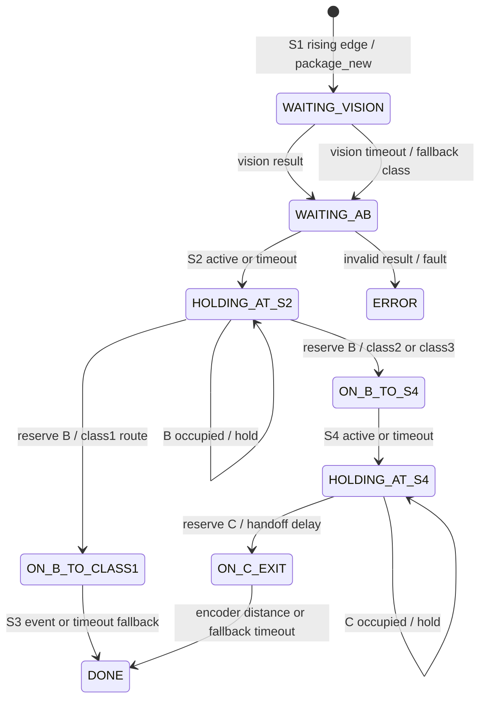

# ESP32-P4 Embedded Edge AI Sorting System

基于 **ESP32-P4** 的端侧视觉识别与自动分拣系统。它不是单独运行一个模型的 Demo，而是把摄像头采集、Edge AI、FreeRTOS 任务、传感器时序、电机调度、LVGL UI、TCP 链路和 Qt 6 上位机串成了一条可运行的工程闭环。

```text
SC2336 Camera + S1/S2 Sensors
        ↓
ESP32-P4: Waybill Detection → ROI Logo Classification
        ↓
Multi-frame Result → Package State Machine → Motor Scheduling
        ↓                         ↓
   LVGL 1024×600 UI       TCP control/metrics + JPEG
                                      ↓
                              Qt 6 Host Monitor
```

**Keywords:** `ESP32-P4` · `ESP-IDF 5.5.4` · `FreeRTOS` · `ESP-DL` · `LVGL 9` · `MIPI CSI/DSI` · `PPA` · `TCP` · `Qt 6 / QML` · `C/C++`

## Demo / 实机效果


真实检测结果与上位机看板：

| 板端识别结果 | Qt 6 上位机看板 |
| --- | --- |
|  |  |


<!-- TODO: Add a short real-hardware sorting GIF or video link showing package entry, detection and motor diversion. -->

## Highlights / 项目亮点

- **端侧两级视觉 Pipeline**：面单整图检测后裁剪 ROI，再进行极兔、韵达、中通 Logo 检测；推理和分拣决策不依赖云端。
- **视觉结果与物理包裹关联**：S1 上升沿创建包裹编号，视觉结果进入同一包裹轨迹，多帧置信度投票后再交给分拣调度器。
- **FreeRTOS 多任务架构**：采集、预览、推理、TCP 控制、JPEG 生产/发送和 System Monitor 分工运行，通过 EventGroup、Queue、Mutex 和稳定帧槽传递数据。
- **可执行的分拣状态机**：维护 A/B/C 三段皮带、S2/S4 交接、占用保护、超时、识别失败兜底和 Emergency Stop，而不是只输出一个分类字符串。
- **双链路工程化通信**：control/metrics 与 image 分离；TCP 接收端按固定头解析半包/粘包，图像 V2 携带 frame、时间戳、推理耗时、类别和检测框。
- **板端 + 上位机可观测**：LVGL 显示检测、推理耗时、任务/内存和链路状态；Qt Quick 上位机提供检测历史、趋势、参数控制和设备状态。

## System Architecture / 系统架构

```mermaid
flowchart LR
    C[SC2336 MIPI Camera] --> BSP[BSP / Capture]
    S[S1 / S2 photoelectric sensors] --> IO[Real I/O observer]
    M[Motor A / B / C + encoder] <-- CTRL[Sorter scheduler]

    subgraph E[ESP32-P4 Firmware]
        BSP --> VF[Vision frame ring]
        VF --> V[Waybill detector]
        V --> R[ROI crop]
        R --> L[Logo classifier]
        L --> F[Multi-frame fusion]
        F --> CTRL
        IO --> CTRL
        UI[LVGL UI] <--> CTRL
        MON[System Monitor] --> UI
        CTRL --> NET[Ethernet TCP]
        F --> NET
    end

    NET -->|control/metrics :5000| H[Qt 6 Host]
    NET -->|JPEG image :5001| H
```

初始化顺序也体现了模块依赖：`LCD → Touch → Camera → Motor → Encoder → LVGL/UI → Monitor → Vision → Ethernet → Sorter`。触摸侧先建立摄像头复用的 I2C 总线，视觉侧随后创建 frame ring、预览任务和推理任务。

## Package Lifecycle / 包裹状态机



当前硬件配置启用 S1=`GPIO22`、S2=`GPIO23`；S3/S4 在配置中保留为 `-1`，因此后两级可由调度器/超时策略接管，但不应在没有对应接线时描述为已完成四传感器实测。传感器实时 I/O 以 10 ms 轮询、20 ms debounce，调度器以 100 ms 周期 tick，并在状态转换时检查占用、交接延时和 timeout。

## Core Implementation / 核心技术实现

### Edge AI Pipeline

问题是：整幅传送带画面同时包含包装、背景和面单，直接做三分类容易把背景纹理带入决策。当前实现把它拆成两个阶段：

1. `vision_fetch` 从相机 frame ring 获取最新 RGB888 帧；推理前复制到稳定帧槽，避免相机 mmap buffer 在推理期间被回收。
2. `waybill.espdl` 在整图上定位面单，取最高分框并在 PSRAM 中复制 ROI。
3. `logo.espdl` 只对 ROI 推理，输出 Logo 框和三类置信度；Logo 框再加回面单左上角偏移，统一回到原图坐标系。
4. `vision_detect` 将结果裁剪到预览坐标系，生成 LVGL 叠框、日志字段和上传元数据；连续 miss 保持最近一次命中最多 5 帧，避免 UI 抖动。

模型由 ESP-DL 的 `dl::Model + ImagePreprocessor + ESPDetPostProcessor` 组成，模型文件从 SPIFFS 加载，当前默认使用 INT8 模型运行路径。图像帧、ROI 和预览中转缓冲按用途分别使用 PSRAM / DMA-capable memory；PPA 用于预览缩放和 framebuffer 搬运。阈值可从板端 UI/上位机下发，模型选择状态持久化到 NVS。

### FreeRTOS / Data Flow

| Task / 模块 | 职责 | 主要同步方式 |
| --- | --- | --- |
| `cam_isp` / camera driver | SC2336 采集与 ISP 输出 | task notification |
| `vision_fetch` | 获取帧并写入 frame ring | EventGroup + ring Mutex |
| `vision_disp` | PPA 缩放、画框、更新 LCD 预览 | EventGroup + LVGL lock |
| `vision_det` | 稳定帧、两级推理、结果融合与上传触发 | EventGroup + stable-frame Mutex |
| `eth_control` | 控制 JSON、metrics、分拣状态和重连 | TCP receive buffer + EventGroup |
| `eth_img_prod` / `eth_img_send` | JPEG 编码、队列排队和分块发送 | Queue + image Mutex |
| `sysmon` | CPU、任务栈、heap、FPS 和链路指标 | snapshot Mutex |

推理 task 不持有 LVGL 锁；预览缩放和画框尽量在锁外完成，最后只在写 framebuffer 时进入 UI 临界区。这一边界是为了避免显示搬运阻塞 ESP-DL worker。

### Sorting State Machine

`sorter_scheduler.c` 保存最多 8 个包裹轨迹，每个轨迹包含包裹编号、类别、所在皮带、状态进入时间、交接时间和 C 段距离。调度器收到三类输入：

- **视觉事件**：将 `waybill → ROI logo` 的最终类别写入对应包裹；
- **传感器事件**：S1 建包，S2 触发 A→B，后续传感器/编码器用于释放与出料；
- **时间/占用事件**：皮带被占用时保持包裹，超时后进入 fallback 或结束轨迹。

电机事件通过 BSP 转换为方向、速度和停止/刹车命令。识别失败不让流水线永久等待，而是使用 `CLASS1 → CLASS2 → CLASS3` 循环兜底；`estop` 会对 A/B/C 三路发出 brake，并在解除后重新调度。

### TCP & Qt Host

板端固定链路为 `192.168.10.2 ↔ 192.168.10.1`：

| Channel | Port | 内容 |
| --- | ---: | --- |
| control / metrics | 5000 | `CONTROL_JSON`、设备状态、metrics、包裹/电机事件、time sync |
| image | 5001 | 新包裹 JPEG 快照及检测元数据 |

公共头为 40 字节，接收端先校验 magic/version/header size/payload length，再等待完整 packet，因此 TCP 半包与粘包不会直接被当成一条消息。Image V2 在 JPEG 前携带 32 字节 metadata 和最多 8 个 16 字节检测框，Qt 上位机据此在 QML 中叠加面单框/Logo 框；协议设计细节可参考 [Qt host 图像结果 V2 设计](docs/superpowers/specs/2026-07-16-qt-host-v2-image-result-display-design.md)，Qt host 源码当前作为独立工程维护。

上位机采用 `QML Page → HostController / HostNetworkWorker → PacketProtocol → TCP` 分层：板端断开时可以展示已有界面，但控制命令仍以真实连接状态为门控。

## Performance / Test Results

以下为仓库已有记录，不代表脱离测试条件的产品指标：

| 指标 | 已有结果 | 条件 / 说明 |
| --- | ---: | --- |
| 三类包裹识别 | 96/100（96%） | 真实包裹，室内自然光，各角度摆放；每类平均，含部分 Logo 被黑色墨痕遮挡样本 |
| 端侧推理 | 约 72–75 ms | ESP32-P4 实板，两级模型；另有 60 样本记录 P95≈71.5 ms |
| 分拣速度 | 20 件/分钟以上 | 既有分拣演示记录，具体速度受皮带、间距和传感器配置影响 |
| 安全交接延时 | 100 ms | 当前默认 `handoff_delay_ms` |
| 图像接收 | 99% 以上 | 既有 TCP 图像链路记录；应结合具体网络与发送队列配置复测 |

## Hardware & Software Environment

| 项目 | 当前配置 |
| --- | --- |
| MCU | ESP32-P4，CPU 360 MHz，启动日志显示约 32 MB PSRAM，PSRAM 200 MHz |
| Camera | SC2336 MIPI CSI，RAW8 1024×600@30；ISP 输出 RGB888 |
| Display / Touch | 1024×600 MIPI DSI/DPI LCD，GT911 touch |
| Actuator | A/B/C 三路直流电机 PWM；编码器接口已预留 |
| Firmware | ESP-IDF 5.5.4、FreeRTOS、LVGL 9.5、ESP-DL、PPA |
| Host | Qt 6 / Qt Quick / QML，C++，CMake + Ninja |

## Project Structure

```text
ESP32P4_Detection/
├── main/                         # 启动与初始化编排
├── components/
│   ├── bsp/                      # LCD、Touch、Camera、电机、编码器、传感器
│   ├── vision/                   # frame ring、模型、ROI、后处理、上传触发
│   ├── Sorter_app/               # 包裹状态机、传感器融合、电机调度
│   ├── Ethernet_app/             # TCP control/metrics/image
│   ├── UI/                       # LVGL 页面与事件绑定
│   ├── system_monitor/           # CPU、任务、heap、FPS、链路指标
│   └── screen_uvc/               # 可选 UVC profile，默认未启用
├── model/                        # waybill.espdl / logo.espdl 等模型资源
├── docs/assets/                  # README 展示图片
├── partitions.csv                # Flash 分区
└── sdkconfig.defaults            # ESP-IDF 默认配置
```

## Build & Run

### ESP32-P4 firmware

```bash
cd ESP32P4_Detection
idf.py set-target esp32p4
idf.py build
idf.py -p <串口> flash monitor
```

烧录前确认 `components/bsp/include/sorter_debug_config.h` 中的 GPIO、传感器有效电平和电机默认输出与实际接线一致。模型分区资源由 `model/` 和 `partitions.csv` 配合使用。

### Qt host

Qt host 为独立工程，使用 Qt 6 / QML / CMake 实现；本仓库保留板端协议、数据字段和链路说明。复现上位机时，将主机地址设为 `192.168.10.1`，监听 TCP `5000/5001`。

## Limitations & Roadmap

- 当前展示固件默认以 S1/S2 实体输入为主，S3/S4 及编码器需要按最终机械接线补齐实机验证。
- UVC 屏幕流代码已保留，但生产启动路径默认关闭；需要单独 profile 验证 JPEG DMA 内存与视觉延迟。
- 现有准确率/吞吐数据仍是特定样本和光照条件下的记录，后续应补充按类别、光照和包裹间距分组的 benchmark。
- 可继续完善异常包裹的机械回收、传感器故障诊断和更细的电机闭环控制。

## Documentation

- [Qt host 图像结果 V2 设计](docs/superpowers/specs/2026-07-16-qt-host-v2-image-result-display-design.md)
- [同帧图像结果上传设计](docs/superpowers/specs/2026-07-16-same-frame-image-result-upload-design.md)
- [ISP 参数控制设计](docs/superpowers/specs/2026-07-16-isp-settings-control-design.md)
- [视觉模型切换设计](docs/superpowers/specs/2026-07-16-vision-model-hot-switch-design.md)
