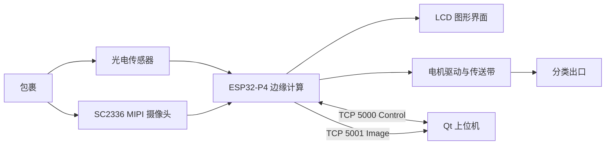
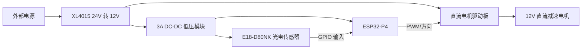
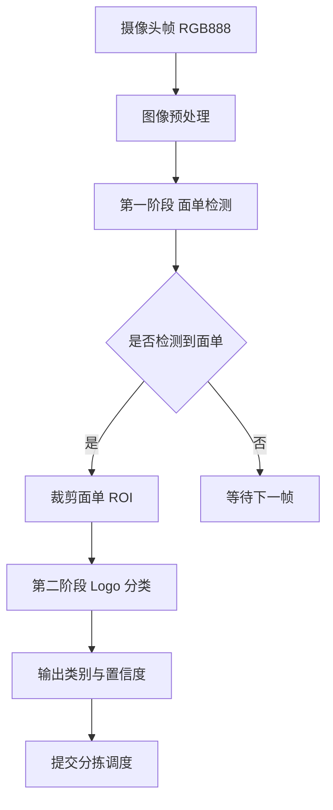
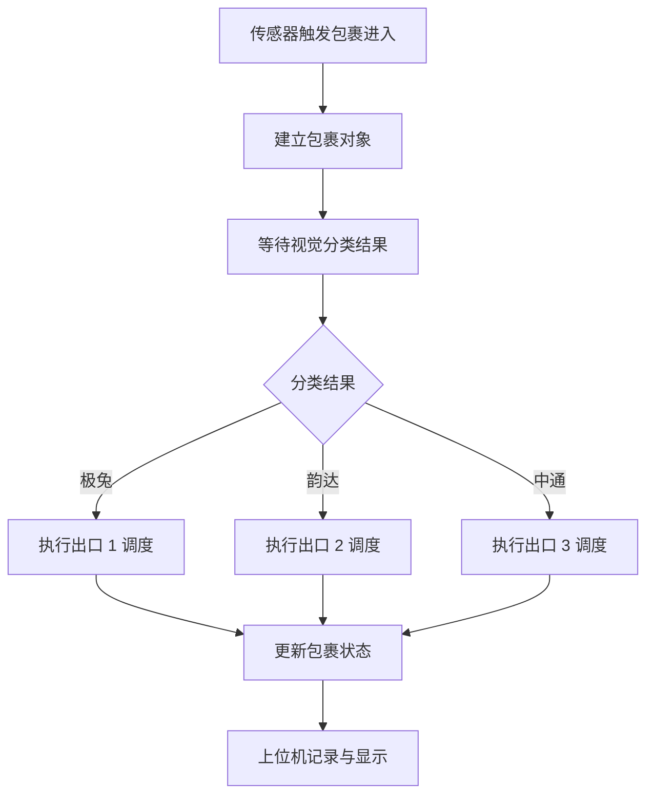
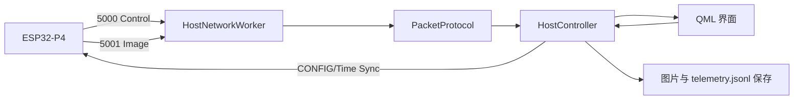

# 基于 ESP32-P4 的快递智能分拣系统与 YOLO 轻量化部署优化

> 初稿说明：本文为比赛作品报告 Markdown 初版。图片、流程图和参考文献格式可在定稿阶段继续替换为正式版。

## 摘要

本作品面向末端快递分拣场景，设计并实现了一套基于 ESP32-P4 的嵌入式边缘 AI 快递智能分拣系统。系统以三段传送带和光电触发结构为基础，通过 SC2336 MIPI 摄像头采集包裹图像，在 ESP32-P4 端完成面单定位与快递 Logo 分类识别，并根据识别结果驱动电机执行分流。系统支持极兔、韵达、中通三类包裹识别与分拣，采用边缘端推理方案，避免依赖高性能 PC 进行实时识别，降低部署复杂度并提升现场响应速度。

在软件架构上，板端集成图像采集、目标检测、分拣调度、LCD 图形界面、以太网通信和系统性能监控；上位机采用 Qt 6 开发，通过 control/image 双 TCP 链路接收板端遥测、识别图像和分拣状态，并支持电机速度控制、图像记录和运行数据留存。系统在良好室内自然光条件下完成 300 件包裹测试，整体识别正确率约 96.7%，分拣速度达到每分钟 20 件以上，图像接收成功率达到 99% 以上。作品验证了在低功耗嵌入式平台上进行实时视觉识别与机械分拣闭环控制的可行性，具备向更多快递类别和小型自动化分拣场景扩展的基础。

## 第一部分 作品概述

### 1.1 功能与特性

本作品实现快递包裹的自动识别、自动分拣、运行显示和上位机监控。包裹进入主传送带后，光电传感器触发检测窗口，摄像头采集图像，ESP32-P4 在本地完成面单区域定位和 Logo 分类识别，再由分拣调度程序控制三路传送带电机，将包裹送往对应出口。LCD 屏幕显示识别画面、运行状态和关键指标；上位机实时接收识别图片、系统性能、图像链路状态和分拣数据，并提供现场控制入口。

建议配图：系统整体实物正面图、上位机检测界面图。

### 1.2 应用领域

系统面向快递末端网点、小型仓储、教学实训和嵌入式 AI 自动化验证场景。对于小批量、多类别的包裹分拣任务，本系统可以用低成本硬件完成视觉识别和自动分流，减少人工识别和搬运压力。由于推理、控制和调度均在边缘端完成，系统对外部计算设备依赖较低，适合在空间有限、网络环境不稳定或需要快速部署的场景中使用。

建议配图：包裹进入传送带和分拣出口照片。

### 1.3 主要技术特点

- 边缘端视觉推理：ESP32-P4 直接完成图像采集、目标检测和分类决策。
- 两级级联检测：第一阶段定位面单区域，第二阶段在面单区域内识别快递 Logo。
- 低延迟闭环控制：视觉识别结果直接进入分拣调度器，触发电机执行机构。
- 双链路上位机通信：control 链路传输遥测和控制，image 链路传输 JPEG 图像。
- 模块化硬件结构：电源、电机驱动、传感器和主控采用模块化搭建，便于调试和维护。

### 1.4 主要性能指标

| 指标 | 当前结果 |
| --- | --- |
| 支持分类 | 极兔、韵达、中通 3 类 |
| 测试样本 | 300 件，每类 100 件 |
| 整体识别正确率 | 约 96.7% |
| 分拣速度 | 20 件/分钟以上 |
| 有效识别置信度参考 | 0.8 |
| 识别到动作触发延迟 | 小于 0.1 s |
| 分拣安全交接延时 | 0.1 s |
| 图像接收成功率 | 99% 以上 |

### 1.5 主要创新点

- 将视觉识别、分拣控制和性能监控集成到 ESP32-P4 边缘端，减少 PC 推理依赖。
- 使用面单定位与 Logo 分类的两级识别流程，提高小目标 Logo 检测稳定性。
- 采用 control/image 双 TCP 链路，避免图像传输阻塞控制与遥测数据。
- 上位机同时承担实时监控、图片留存、状态诊断和控制下发，便于现场调试。

### 1.6 设计流程

系统设计流程为：需求分析 -> 机械与电源方案设计 -> 传送带和传感器搭建 -> 摄像头采集调试 -> 视觉模型部署 -> 分拣调度程序开发 -> 板端 UI 与上位机通信开发 -> 联调测试与性能优化。整体目标是形成从包裹进入、视觉识别、分拣控制到数据记录的完整闭环。

## 第二部分 系统组成及功能说明

### 2.1 整体介绍

系统由感知层、边缘计算层、执行层和上位机层组成。感知层通过摄像头和光电传感器获取包裹图像与位置状态；边缘计算层以 ESP32-P4 为核心，运行视觉识别、分拣调度、LCD UI 和以太网通信；执行层由三路传送带、电机驱动板、直流减速电机和电源模块组成；上位机层用于实时显示、数据留存和控制下发。

系统工作过程如下：

1. 包裹进入主传送带，光电传感器产生到位信号。
2. 摄像头采集包裹图像，板端图像链路输出 RGB 图像。
3. ESP32-P4 运行第一阶段模型定位面单区域。
4. 第二阶段模型在面单区域内识别快递 Logo 分类。
5. 分拣调度器根据分类、传感器状态和时间参数控制电机动作。
6. 上位机接收图像、遥测和分拣状态，用于展示、记录和调参。

### 2.2 硬件系统介绍

#### 2.2.1 硬件整体介绍

硬件系统以 ESP32-P4 开发套件为核心，外接 SC2336 MIPI 摄像头、1024 x 600 LCD 屏、GT911 触摸、电机驱动板、直流减速电机、E18-D80NK 光电传感器和多路 DC-DC 电源模块。整机采用三段传送带结构，主传送带负责包裹进入和识别，分拣传送带负责将不同类别包裹送入对应出口。

| 模块 | 型号或参数 | 功能 |
| --- | --- | --- |
| 主控 | ESP32-P4 | 视觉识别、调度控制、通信和 UI |
| 摄像头 | SC2336，2MP，MIPI，100 度广角，可调焦 | 图像采集 |
| 显示屏 | 1024 x 600 MIPI DSI/DPI LCD | 本地状态显示 |
| 触摸 | GT911 | 本地交互 |
| 光电传感器 | E18-D80NK，DC 3.3V，PNP 常开 | 包裹到位检测 |
| 电机 | 42GM-775 行星直流减速电机，12V，50:1，160 rpm | 传送带驱动 |
| 电机驱动 | 450W 直流电机驱动板 | PWM、正反转、刹车 |
| 电源 | XL4015 四路降压板、3A DC-DC 模块 | 供电转换 |

#### 2.2.2 机械设计介绍

机械部分采用 4080 国标铝型材搭建主体框架，配合主动滚筒、从动滚筒、铝头座和铝尾座形成传送带结构。主传送带 A 尺寸为 100 cm x 40 cm，分拣传送带 B/C 尺寸为 40 cm x 40 cm。摄像头安装高度约 60 cm，通过手动调焦保证包裹面单区域清晰成像。

| 部件 | 设计说明 |
| --- | --- |
| 主传送带 A | 负责包裹进入、图像采集和前级输送 |
| 分拣传送带 B/C | 负责不同类别包裹的分流输出 |
| 机架 | 4080 国标铝型材，便于调整和重复装配 |
| 摄像头支架 | 摄像头安装高度约 60 cm，可手动调焦 |
| 滚筒组件 | 主动滚筒和从动滚筒支撑皮带运行 |

建议配图：

- `../2b9b7d1216bb0c666e4a67f205c1bf1d.jpg`：滚筒尺寸图。
- `../7e5328ddb76a2681f0dd24bce1040a4a.jpg`：4080 型材尺寸图。

#### 2.2.3 电路各模块介绍

系统没有自行绘制 PCB，采用模块化电路搭建。电源部分由 24V 输入经 XL4015 四通道降压模块输出 12V，再由 3A DC-DC 多路电源模块提供 3.3V/5V 低压供电。电机驱动板输入 12V 电源，ESP32-P4 输出 PWM/方向控制信号控制电机运行。光电传感器以 PNP 常开方式接入 ESP32-P4 GPIO，用于包裹位置判断。

| 信号/模块 | 连接关系 |
| --- | --- |
| 24V 输入 | 输入至 XL4015 降压板 |
| 12V 输出 | 电机驱动板、电机和相关 12V 模块 |
| 3.3V/5V 输出 | 传感器、控制板和低压外设 |
| 电机 A | ESP32-P4 GPIO2/GPIO3 控制 |
| 电机 B | ESP32-P4 GPIO32/GPIO36 控制 |
| 电机 C | ESP32-P4 GPIO4/GPIO5 控制 |
| S1 | GPIO53 |
| S2 | GPIO23 |
| S3 | GPIO38 |
| S4 | GPIO22 |

### 2.3 软件系统介绍

#### 2.3.1 软件整体介绍

软件系统分为板端固件和 PC 上位机两部分。板端固件运行在 ESP32-P4 上，包含系统初始化、摄像头采集、目标检测、分拣调度、LCD UI、系统监控和以太网通信。上位机基于 Qt 6 开发，负责监听板端 TCP 连接，显示图像与遥测，保存包裹记录，并向板端下发控制命令。

| 软件层级 | 关键模块 | 功能 |
| --- | --- | --- |
| 板级驱动 | BSP | LCD、摄像头、触摸、电机、传感器、以太网 |
| 视觉识别 | Vision | 面单检测、Logo 分类、结果输出 |
| 分拣控制 | Sorter | 包裹状态机、电机调度、传感器事件处理 |
| 本地 UI | LVGL | 板端显示、性能信息和调试状态 |
| 网络通信 | Ethernet_app | control/image 双 TCP 链路 |
| 上位机 | Qt 6 | 图像显示、遥测趋势、控制和数据保存 |

#### 2.3.2 视觉识别模块

视觉识别模块采用两级目标检测流程。第一阶段在整幅图像中检测面单区域，第二阶段在面单区域内检测快递 Logo，并输出类别和置信度。该设计减少了第二阶段的搜索范围，有助于提升小目标 Logo 识别稳定性和推理效率。

关键输入输出：

| 项目 | 内容 |
| --- | --- |
| 输入 | 摄像头 RGB 图像、模型阈值、包裹触发状态 |
| 输出 | 面单框、Logo 框、分类 ID、置信度、快照图像 |
| 当前类别 | 极兔、韵达、中通 |
| 快照策略 | 每个包裹对象发送一次图片，避免同一包裹重复上传 |

#### 2.3.3 分拣调度模块

分拣调度模块根据光电传感器事件、识别分类和传送带时序控制电机运行。主传送带负责将包裹送入识别区域，分拣传送带根据分类结果进行分流。系统设置 0.1 s 安全交接延时，用于保证包裹在机械过渡阶段稳定进入下一段传送带。

默认调度参数：

| 参数 | 当前值 |
| --- | --- |
| A 电机默认速度 | 60% |
| B 电机默认速度 | 100% |
| C 电机默认速度 | 100% |
| 交接延时 | 100 ms |
| A 传送带超时 | 4500 ms |
| B 传送带超时 | 900 ms |
| C 传送带超时 | 1300 ms |

#### 2.3.4 上位机模块

上位机采用 Qt 6 Quick + Qt Network + C++ 开发。系统监听 control 端口 5000 和 image 端口 5001，分别接收遥测/控制数据和 JPEG 图像数据。上位机界面显示板端连接状态、CPU/内存/PSRAM、图像链路健康、最新识别图片、历史包裹记录和电机控制入口。

上位机功能：

- 实时接收和显示识别图片。
- 保存每个包裹的检测照片和分拣数据。
- 展示 CPU、内存、PSRAM、FPS、图像编码和发送状态。
- 显示图像链路队列、丢弃、发送耗时等诊断指标。
- 下发时间同步和电机速度控制命令。

## 第三部分 完成情况及性能参数

### 3.1 整体介绍

目前系统已完成主控、摄像头、传送带、电机驱动、光电传感器、板端 LCD UI 和 PC 上位机的联调。整机能够完成从包裹进入、图像采集、边缘端识别、分拣执行、上位机显示和数据记录的闭环流程。

待插入图片：

- 系统整体正面照片。
- 系统斜 45 度全局照片。
- 上位机实时监控界面截图。

### 3.2 工程成果

#### 3.2.1 机械成果

机械结构采用 4080 铝型材框架和三段传送带结构。主传送带用于图像采集与前级输送，分拣传送带用于包裹分流。摄像头固定在传送带上方约 60 cm 位置，通过手动调焦保证面单区域清晰。整体结构便于调节摄像头角度、传感器位置和传送带相对距离，适合比赛现场快速维护。

#### 3.2.2 电路成果

电路系统采用模块化搭建方式，包括 XL4015 降压电源板、3A DC-DC 低压模块、直流电机驱动板、光电传感器和 ESP32-P4 开发套件。各模块通过端子和杜邦线连接，关键电源和地线保持共地。模块化电路降低了制板周期，也便于现场替换和排查故障。

#### 3.2.3 软件成果

板端软件已实现摄像头采集、目标检测、分类结果显示、分拣调度、电机控制、传感器输入、系统性能监视和以太网通信。上位机已实现双 TCP 监听、图像显示、遥测趋势、链路健康显示、包裹历史记录、本地数据保存和控制命令下发。测试中 control/image 链路均能正常工作。

### 3.3 特性成果与量化指标

#### 3.3.1 识别准确率测试

测试在室内自然光照条件下进行，每类快递包裹测试 100 件。测试样本包含不同摆放角度的真实包裹，其中部分样本存在黑色墨痕覆盖 Logo 局部区域的情况。

| 类别 | 测试数量 | 正确识别 | 错分 | 漏检 | 正确率 |
| --- | --- | --- | --- | --- | --- |
| 极兔 | 100 | 98 | 1 | 1 | 98% |
| 韵达 | 100 | 93 | 6 | 1 | 93% |
| 中通 | 100 | 99 | 0 | 1 | 99% |
| 合计 | 300 | 290 | 7 | 3 | 96.7% |

#### 3.3.2 分拣速度与延迟

系统在良好光照条件下可达到每分钟 20 件以上的分拣速度。识别结果到分拣动作触发的延迟小于 0.1 s，机械交接过程设置 0.1 s 安全延时，以提高包裹进入下一段传送带时的稳定性。

#### 3.3.3 通信与上位机记录

上位机通过固定 IP 以太网连接板端，板端地址为 `192.168.10.2`，上位机地址为 `192.168.10.1/24`。control 端口为 `5000/tcp`，image 端口为 `5001/tcp`。测试中图像接收成功率达到 99% 以上，上位机可以显示最新包裹图片、记录历史图像，并持续接收 1 秒周期遥测数据。

## 第四部分 总结

### 4.1 可扩展之处

后续可以从四个方向继续扩展。第一，增加快递类别和样本数量，提升模型对不同面单、不同光照和遮挡情况的泛化能力。第二，加入稳定补光和更完整的相机标定流程，减少环境光变化对识别结果的影响。第三，增加编码器闭环或更精细的速度反馈，使传送带调度从开环时序控制升级为位置闭环控制。第四，设计专用 PCB 和线束，替代当前模块化接线方式，提高整机可靠性和现场维护效率。后续也可扩展破损检测、尺寸估计和云端数据同步，但这些功能应在新增硬件和软件闭环后再写入正式成果。

### 4.2 心得体会

本作品的研发过程体现了嵌入式 AI 系统从算法验证走向工程闭环的复杂性。单独完成视觉识别并不等于完成分拣系统，真正的难点在于图像采集、模型推理、传感器触发、电机控制、网络传输和界面显示之间的实时协同。ESP32-P4 的资源相对桌面平台有限，因此在模型部署和系统任务安排上需要持续优化，既要保证识别稳定，又要避免图像链路、LCD 刷新和分拣控制互相阻塞。

机械和电路部分也对软件设计提出了约束。传送带速度、摄像头高度、光电传感器安装位置和电机响应都会影响分拣效果。调试过程中需要不断在硬件现象和软件日志之间建立对应关系，才能判断问题来自识别、通信、传感器还是执行机构。上位机的加入提升了现场调试效率，它不仅显示结果，还能记录图片、遥测和链路状态，使问题定位更加直观。

通过本项目，团队完成了从硬件搭建、模型部署、嵌入式开发到上位机软件设计的完整实践。系统最终能够完成三类快递包裹识别与分拣，说明低功耗边缘设备在小型自动化分拣场景中具有实际应用潜力。

## 第五部分 参考文献

> 初稿参考文献，定稿前需统一为比赛要求的标准格式，并核对版本、链接和访问日期。

[1] Espressif Systems. ESP32-P4 Series Datasheet.

[2] Espressif Systems. ESP-IDF Programming Guide.

[3] Espressif Systems. ESP-DL User Guide.

[4] LVGL Project. LVGL Documentation.

[5] The Qt Company. Qt 6 Documentation.

[6] SmartSens Technology. SC2336 CMOS Image Sensor Product Brief or Datasheet.

[7] E18-D80NK Infrared Photoelectric Sensor Module Datasheet.

[8] 42GM-775 Planetary DC Gear Motor Product Specification.

[9] XL4015 DC-DC Buck Converter Module Product Specification.
