# 基于 ESP32-P4 的快递智能分拣系统与 YOLO 轻量化部署优化

## 摘要

本作品面向末端快递分拣场景，设计并实现了一套基于 ESP32-P4 的嵌入式边缘 AI 快递智能分拣系统。系统以三段传送带和光电触发结构为基础，通过 SC2336 MIPI 摄像头采集包裹图像，在 ESP32-P4 端完成面单定位与快递 Logo 分类识别，并根据识别结果驱动电机执行分流。系统支持极兔、韵达、中通三类包裹识别与分拣，采用边缘端推理方案，避免依赖高性能 PC 进行实时识别。

在软件架构上，板端集成图像采集、目标检测、分拣调度、LCD 图形界面、以太网通信和系统性能监控；上位机采用 Qt 6 开发，通过 control/image 双 TCP 链路接收板端遥测、识别图像和分拣状态，并支持电机速度控制、图像记录和运行数据留存。模型训练阶段整理约 5000 张训练图片，针对数据质量、数据增强和量化策略进行多轮调整；系统调试阶段围绕 PSRAM 带宽竞争解决了早期 LCD 蓝屏闪烁问题。系统在良好室内自然光条件下完成 300 件包裹测试，整体识别正确率约 96.7%，分拣速度达到每分钟 20 件以上，图像接收成功率达到 99% 以上。

## 第一部分 作品概述

### 1.1 功能与特性

本作品实现快递包裹的自动识别、自动分拣、运行显示和上位机监控。包裹进入主传送带后，光电传感器触发检测窗口，摄像头采集图像，ESP32-P4 在本地完成面单区域定位和 Logo 分类识别，再由分拣调度程序控制三路传送带电机，将包裹送往对应出口。LCD 屏幕显示识别画面、运行状态和关键指标；上位机实时接收识别图片、系统性能、图像链路状态和分拣数据，并提供现场控制入口。

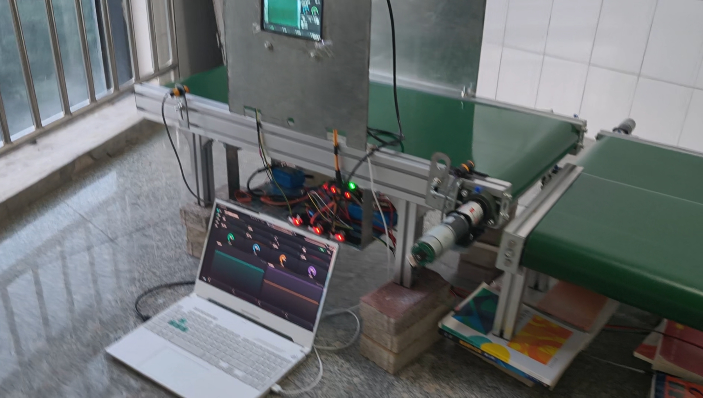

图：系统整体正面实拍图，展示三段传送带、板端显示、电源/驱动模块和上位机联调环境。

图：上位机视觉检测界面，显示包裹图像、面单框、Logo 检测框、分类结果和历史记录。

### 1.2 应用领域

系统面向快递末端网点、小型仓储、教学实训和嵌入式 AI 自动化验证场景。对于小批量、多类别的包裹分拣任务，本系统可以用嵌入式硬件完成视觉识别和自动分流，减少人工识别和搬运压力。由于推理、控制和调度均在边缘端完成，系统对外部计算设备依赖较低，适合在空间有限、网络环境不稳定或需要快速部署的场景中使用。

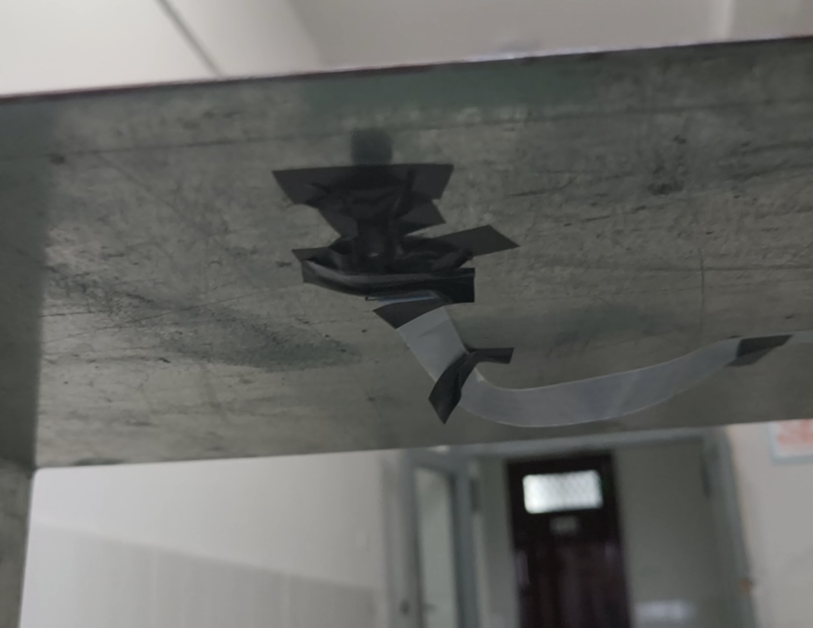

图：摄像头安装在传送带上方约 60 cm 位置，通过手动调焦保证面单和 Logo 区域清晰成像。

### 1.3 主要技术特点

- 边缘端视觉推理：ESP32-P4 直接完成图像采集、目标检测和分类决策。
- 两级级联检测：第一阶段定位面单区域，第二阶段在面单区域内识别快递 Logo。
- 模型训练优化：基于约 5000 张图片进行训练，筛选高质量数据集并调整数据增强。
- 低损失量化部署：采用 MSE equalization `(10, 0.1)` 量化策略，无 TQT、无 bias correction。
- 显示稳定性优化：针对 LCD 蓝屏闪烁问题优化 PSRAM 带宽、摄像头帧率和总线仲裁优先级。
- 双链路上位机通信：control 链路传输遥测和控制，image 链路传输 JPEG 图像。
- 模块化硬件结构：电源、电机驱动、传感器和主控采用模块化搭建，便于调试和维护。

### 1.4 主要性能指标

| 指标 | 当前结果 |
| --- | --- |
| 支持分类 | 极兔、韵达、中通 3 类 |
| 测试样本 | 300 件，每类 100 件 |
| 整体识别正确率 | 约 96.7% |
| 分拣速度 | 20 件/分钟以上 |
| 有效识别置信度参考 | 0.8 |
| 识别到动作触发延迟 | 小于 0.1 s |
| 分拣安全交接延时 | 0.1 s |
| 图像接收成功率 | 99% 以上 |
| 显示稳定性 | 已修复早期 LCD 蓝屏闪烁问题 |

### 1.5 主要创新点

- 将视觉识别、分拣控制和性能监控集成到 ESP32-P4 边缘端，减少 PC 推理依赖。
- 使用面单定位与 Logo 分类的两级识别流程，提高小目标 Logo 检测稳定性。
- 针对 ESP32-P4 的 PSRAM 带宽瓶颈进行系统级优化，提升摄像头、LCD、推理和网络并发稳定性。
- 采用 control/image 双 TCP 链路，避免图像传输阻塞控制与遥测数据。
- 上位机同时承担实时监控、图片留存、状态诊断和控制下发，便于现场调试。

### 1.6 设计流程

系统设计流程为：需求分析 -> 机械与电源方案设计 -> 传送带和传感器搭建 -> 摄像头采集调试 -> 视觉模型训练与部署 -> 分拣调度程序开发 -> 板端 UI 与上位机通信开发 -> 联调测试与性能优化。整体目标是形成从包裹进入、视觉识别、分拣控制到数据记录的完整闭环。

## 第二部分 系统组成及功能说明

### 2.1 整体介绍

系统由感知层、边缘计算层、执行层和上位机层组成。感知层通过摄像头和光电传感器获取包裹图像与位置状态；边缘计算层以 ESP32-P4 为核心，运行视觉识别、分拣调度、LCD UI 和以太网通信；执行层由三路传送带、电机驱动板、直流减速电机和电源模块组成；上位机层用于实时显示、数据留存和控制下发。

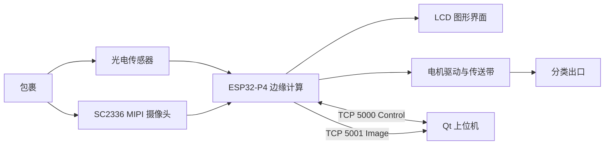

系统工作过程如下：

1. 包裹进入主传送带，光电传感器产生到位信号。
2. 摄像头采集包裹图像，板端图像链路输出 RGB 图像。
3. ESP32-P4 运行第一阶段模型定位面单区域。
4. 第二阶段模型在面单区域内识别快递 Logo 分类。
5. 分拣调度器根据分类、传感器状态和时间参数控制电机动作。
6. 上位机接收图像、遥测和分拣状态，用于展示、记录和调参。

从固件启动流程看，系统不是把各功能模块简单并列运行，而是按外设依赖关系分层启动。`System_Init()` 首先完成以太网早期初始化，然后初始化 LCD、触摸和摄像头；摄像头 SCCB 复用触摸 I2C 总线，因此必须放在触摸初始化之后。随后启动 LVGL 适配层并创建 UI，在 LVGL 锁内绑定仪表盘事件处理函数，包括背光亮度、检测开关、预览框开关、面单阈值、Logo 阈值和模型信息读取。UI 就绪后立即启动系统监视任务，再启动视觉链路、屏幕 UVC 输出和以太网链路。这样的顺序保证了视觉任务创建前预览容器、framebuffer、PPA 资源和模型文件已经准备好，也保证了上位机连接后能够立即拿到 CPU、内存和图像链路状态。

系统内部的数据流可以概括为“采集任务生产原图帧、显示任务消费预览帧、推理任务消费同一帧、通信任务只发送识别成功后的快照”。摄像头帧通过 ring buffer 被多个任务共享，推理任务输出面单框、Logo 框、类别和置信度；显示任务把框绘制到 LCD 预览区域；以太网任务只在新包裹识别成功时取带框快照并编码为 JPEG，避免把连续视频流直接压到网络和 PSRAM 上。

### 2.2 硬件系统介绍

#### 2.2.1 硬件整体介绍

硬件系统以 ESP32-P4 开发套件为核心，外接 SC2336 MIPI 摄像头、1024 x 600 LCD 屏、GT911 触摸、电机驱动板、直流减速电机、E18-D80NK 光电传感器和多路 DC-DC 电源模块。整机采用三段传送带结构，主传送带负责包裹进入和识别，分拣传送带负责将不同类别包裹送入对应出口。

| 模块 | 型号或参数 | 功能 |
| --- | --- | --- |
| 主控 | ESP32-P4 | 视觉识别、调度控制、通信和 UI |
| 摄像头 | SC2336，2MP，MIPI，100 度广角，可调焦 | 图像采集 |
| 显示屏 | 1024 x 600 MIPI DSI/DPI LCD | 本地状态显示 |
| 触摸 | GT911 | 本地交互 |
| 光电传感器 | E18-D80NK，DC 3.3V，PNP 常开 | 包裹到位检测 |
| 电机 | 42GM-775 行星直流减速电机，12V，50:1，160 rpm | 传送带驱动 |
| 电机驱动 | 450W 直流电机驱动板 | PWM、正反转、刹车 |
| 电源 | XL4015 四路降压板、3A DC-DC 模块 | 供电转换 |

主控板外设驱动采用 BSP 分层封装。LCD 初始化中使用 1024 x 600 RGB888 面板配置，MIPI DSI 两 lane 输出，DPI clock 设置为 26 MHz，并启用 DMA2D 参与 framebuffer 搬运。LVGL 使用 double direct framebuffer，视觉显示任务从 BSP 取得两块物理 framebuffer 后，把视频区域同时写入两块缓冲，避免双缓冲翻转时出现旧画面残留。背光由 GPIO26 的 LEDC PWM 控制，频率 5 kHz、13 bit 占空比分辨率，并加入 gamma 2.2 映射和 8% 最低亮度下限，使低亮度调节更平滑。

摄像头、LCD、PPA 和模型推理都需要访问 PSRAM，因此硬件驱动层还加入了总线仲裁优化。LCD BSP 中对 ESP32-P4 AXI ICM 的 QoS 进行配置，将 DW-GDMA 读优先级提升到 15，写优先级为 8；Cache 读写优先级设为 4；CPU 聚合口读写优先级设为 2。该设置优先保证 DSI/CSI DMA 的持续读写，降低显示 FIFO underrun 的概率，是修复蓝屏闪烁问题的关键硬件软件协同措施之一。

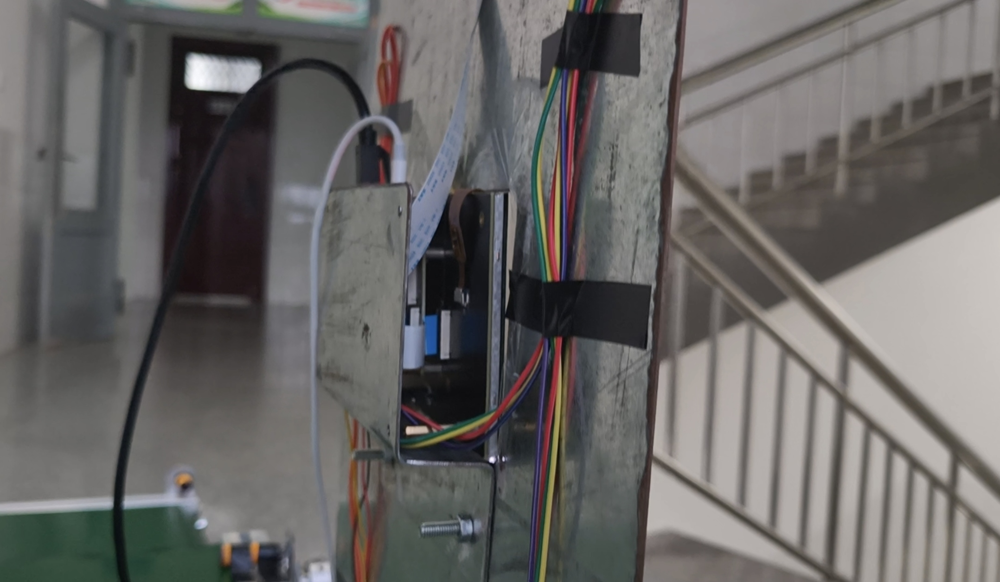

图：ESP32-P4 板端安装在机架背面，线束沿结构件固定，便于将摄像头、显示、传感器和电机控制信号引出到各功能模块。

图：电池、电源板和电机驱动板实物接线图，用于展示模块化电源与执行机构连接方式。

#### 2.2.2 机械设计介绍

机械部分采用 4080 国标铝型材搭建主体框架，配合主动滚筒、从动滚筒、铝头座和铝尾座形成传送带结构。主传送带 A 尺寸为 100 cm x 40 cm，分拣传送带 B/C 尺寸为 40 cm x 40 cm。摄像头安装高度约 60 cm，通过手动调焦保证包裹面单区域清晰成像。

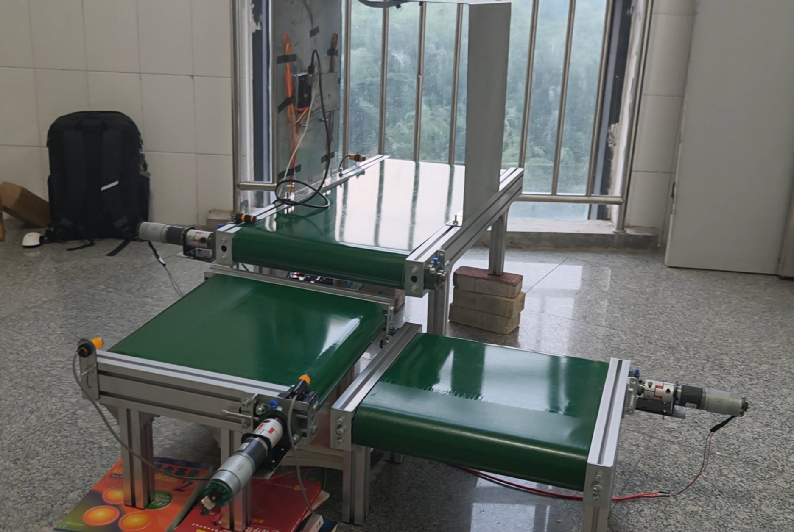

图：三段传送带位置布局，主传送带负责识别与前级输送，两侧传送带负责分类输出。

| 部件 | 设计说明 |
| --- | --- |
| 主传送带 A | 负责包裹进入、图像采集和前级输送 |
| 分拣传送带 B/C | 负责不同类别包裹的分流输出 |
| 机架 | 4080 国标铝型材，便于调整和重复装配 |
| 摄像头支架 | 摄像头安装高度约 60 cm，可手动调焦 |
| 滚筒组件 | 主动滚筒和从动滚筒支撑皮带运行 |

#### 2.2.3 电路各模块介绍

系统没有自行绘制 PCB，采用模块化电路搭建。电源部分由 24V 输入经 XL4015 四通道降压模块输出 12V，再由 3A DC-DC 多路电源模块提供 3.3V/5V 低压供电。电机驱动板输入 12V 电源，ESP32-P4 输出 PWM/方向控制信号控制电机运行。光电传感器以 PNP 常开方式接入 ESP32-P4 GPIO，用于包裹位置判断。

| 信号/模块 | 连接关系 |
| --- | --- |
| 24V 输入 | 输入至 XL4015 降压板 |
| 12V 输出 | 电机驱动板、电机和相关 12V 模块 |
| 3.3V/5V 输出 | 传感器、控制板和低压外设 |
| 电机 A | ESP32-P4 GPIO2/GPIO3 控制 |
| 电机 B | ESP32-P4 GPIO32/GPIO36 控制 |
| 电机 C | ESP32-P4 GPIO4/GPIO5 控制 |
| S1 | GPIO53 |
| S2 | GPIO23 |
| S3 | GPIO38 |
| S4 | GPIO22 |

电机和传感器接口在固件中集中配置，避免硬编码散落在业务逻辑中。电机控制采用三路双 PWM/方向信号：A 路对应 GPIO2/GPIO3，B 路对应 GPIO32/GPIO36，C 路对应 GPIO4/GPIO5；速度默认值分别为 60%、100%、100%。光电传感器采用 active high 逻辑，S1、S2、S4 在当前调试配置中分别为 GPIO53、GPIO23、GPIO22；S3 在最终接线表中预留为 GPIO38。固件层支持将暂未接入的传感器配置为 `-1` 禁用输入，因此在未插板或未确认接线时可以防止误读 GPIO 触发电机调度。

电路控制软件同时保留真实 IO、以太网仿真和定时模式三种入口。真实模式下，传感器任务以 10 ms 周期轮询，20 ms 去抖后把 S1/S2/S4 等事件提交给分拣状态机；未接实物时，可通过上位机发送 `PACKAGE_NEW`、`VISION_RESULT`、`SENSOR`、`CONFIG` 等调试命令复现包裹进入、视觉结果和传感器触发过程，便于在没有接入完整硬件时验证调度逻辑。

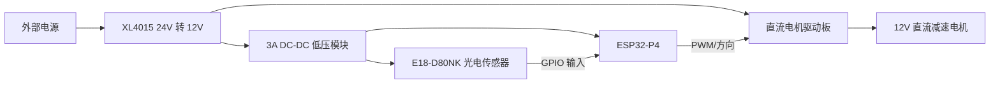

### 2.3 软件系统介绍

#### 2.3.1 软件整体介绍

软件系统分为板端固件和 PC 上位机两部分。板端固件运行在 ESP32-P4 上，包含系统初始化、摄像头采集、目标检测、分拣调度、LCD UI、系统监控和以太网通信。上位机基于 Qt 6 开发，负责监听板端 TCP 连接，显示图像与遥测，保存包裹记录，并向板端下发控制命令。

| 软件层级 | 关键模块 | 功能 |
| --- | --- | --- |
| 板级驱动 | BSP | LCD、摄像头、触摸、电机、传感器、以太网 |
| 视觉识别 | Vision | 面单检测、Logo 分类、结果输出 |
| 分拣控制 | Sorter | 包裹状态机、电机调度、传感器事件处理 |
| 本地 UI | LVGL | 板端显示、性能信息和调试状态 |
| 网络通信 | Ethernet_app | control/image 双 TCP 链路 |
| 上位机 | Qt 6 | 图像显示、遥测趋势、控制和数据保存 |

板端软件采用任务解耦方式实现。系统监视任务每 250 ms 采集一次 CPU、任务数量、堆内存、内部 RAM、PSRAM、最大连续空闲块、运行时间、CPU 频率和温度，并把结果同时推送给 LVGL UI 与上位机 metrics 包。视觉链路包含采集、显示、推理三个 FreeRTOS 任务；以太网链路包含 control 任务、图像生产任务和图像发送任务；分拣链路包含调度器、真实 IO 轮询、命令解析和电机输出控制。各模块之间只传递结构化状态和事件，避免 UI、网络、视觉和电机控制互相直接阻塞。

源码中的模块边界如下：

| 模块 | 主要实现文件 | 关键实现 |
| --- | --- | --- |
| 系统启动 | `main/system_init.c` | 按外设依赖启动 LCD、触摸、相机、UI、监控、视觉、UVC 和以太网 |
| LCD/BSP | `components/bsp/bsp_lcd.c` | MIPI DSI、double framebuffer、DMA2D、背光 PWM、AXI QoS |
| 视觉帧流 | `components/vision/framework/vision_app.c` | ring buffer、PPA 缩放、LCD 直刷、带框快照 |
| 推理任务 | `components/vision/framework/vision_detect.c` | 订阅新帧、两级推理、坐标缩放、UI 结果、快照闸门 |
| 模型封装 | `components/vision/detector/vision_model.cpp` | SPIFFS 模型加载、ESP-DL 推理、ROI 裁剪和坐标映射 |
| 分拣调度 | `components/Sorter_app/sorter_core/sorter_scheduler.c` | 包裹状态机、B/C 占用、超时兜底、S2/S4 交接 |
| 上位机链路 | `components/Ethernet_app/ethernet_app.c` | 静态 IP、协议包、metrics、JPEG 队列、control/image 双连接 |
| PC 上位机 | `esp32_host_no_inference/` | Qt 网络线程、协议解析、图片落盘、遥测曲线、控制命令 |

#### 2.3.2 视觉识别模块

视觉识别模块采用两级目标检测流程。第一阶段在整幅图像中检测面单区域，第二阶段在面单区域内检测快递 Logo，并输出类别和置信度。该设计减少了第二阶段的搜索范围，有助于提升小目标 Logo 识别稳定性和推理效率。

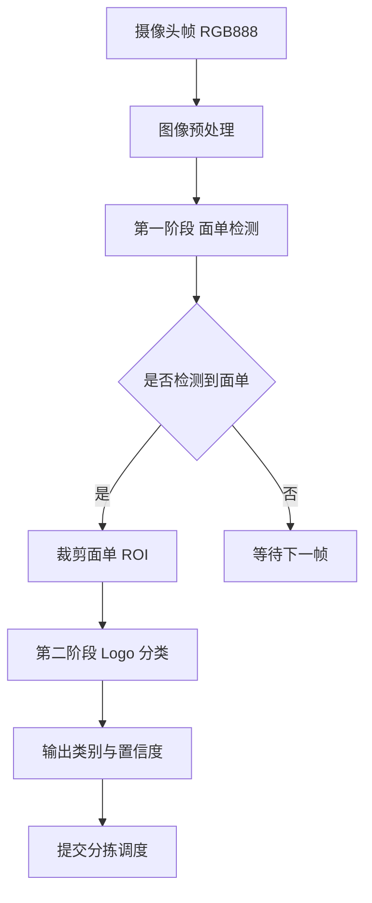

关键输入输出：

| 项目 | 内容 |
| --- | --- |
| 输入 | 摄像头 RGB 图像、模型阈值、包裹触发状态 |
| 输出 | 面单框、Logo 框、分类 ID、置信度、快照图像 |
| 当前类别 | 极兔、韵达、中通 |
| 快照策略 | 每个包裹对象发送一次图片，连续 3 次 miss 后允许下一次 capture |

视觉链路的核心实现是 ESP-who 风格的零拷贝帧总线。采集任务运行在 core0，从 V4L2 取出摄像头 mmap 帧后并不复制整帧图像，而是把帧引用放入 ring buffer；当 ring buffer 满时才归还最旧帧给驱动，保证被持有的帧不会立即被摄像头覆盖。显示任务和推理任务各自订阅 `VISION_NEW_FRAME` 事件，收到事件后只 peek 最新帧的指针。这样显示与推理可以读取同一张原图，减少 640 x 480 RGB888 大块 memcpy 对 PSRAM 的压力。

| 视觉任务 | 运行核心 | 主要工作 | 内存策略 |
| --- | --- | --- | --- |
| `vision_fetch` | core0 | DQBUF 取帧、维护 ring buffer、通知订阅者 | 只保存帧引用，不复制原图 |
| `vision_disp` | core0 | PPA 缩放/色彩转换、绘制检测框、写入 LCD 视频区域 | 使用 PSRAM DMA 预览缓冲，双 framebuffer 同步写入 |
| `vision_det` | core1 | 读取最新帧、运行两级模型、生成 UI/分拣/快照结果 | 推理任务栈放内部 SRAM，避免 PSRAM 栈死锁风险 |

检测任务中，模型输出的框先保持在原图坐标系，然后按当前 UI 预览区域尺寸缩放到屏幕坐标系，并对边界进行 clip。面单框和 Logo 框带有不同的 `stage` 标记，显示侧据此使用不同颜色绘制。识别成功时，检测任务会把类别提交给分拣控制层，同时触发一次 `vision_boxed_snapshot_capture()`，用 PPA 将当前原图缩放到 640 x 375，并把同一帧的检测框 burn-in 到快照图像中。快照闸门在一次成功 capture 后关闭，连续 3 次 miss 后才重新打开，避免同一个包裹因检测抖动重复发送图片。

#### 2.3.3 模型训练与轻量化部署

模型训练阶段围绕真实快递包裹场景构建训练集，累计整理约 5000 张图片，覆盖不同摆放角度、面单位置、Logo 清晰度、光照变化和局部遮挡情况。训练过程中并不是简单追求样本数量，而是重点筛选与实际演示环境一致的高质量样本。调试中发现，反光严重、Logo 失真或眩光过强的数据反而可能伤害模型，使模型学习到不稳定背景特征，因此最终对这类样本进行筛选，并控制数据增强强度。

在部署到 ESP32-P4 时，模型需要经过轻量化和量化处理。项目中测试了多种量化策略，最终采用 MSE equalization 量化策略，参数设置为 `(10, 0.1)`，未使用 TQT，也未启用 bias correction。该策略在当前模型上精度损失较低，能够兼顾嵌入式端实时推理和分类准确率。结合两级检测流程，系统将第二阶段 Logo 检测限制在面单区域内，进一步减少无效搜索范围，提高了边缘端推理效率。

模型部署实现中，两级模型以 `.espdl` 文件形式放入 SPIFFS 分区，运行时挂载 `/spiffs` 后分别加载 `waybill.espdl` 和 `logo.espdl`。第一阶段模型输入为整帧图像，用于在全图范围内寻找面单；第二阶段模型输入为面单 ROI，用于识别三类 Logo。模型封装层内部使用 ESP-DL 的 `dl::Model`、`ImagePreprocessor` 和 `ESPDetPostProcessor`，并通过 `PicoDetect` 子类封装成统一的 `vision_detector_run()` 接口。这样上层检测任务不需要关心 C++ 模型对象，只通过 C 接口传入 RGB888 裸图像和输出框数组。

两级级联的实际运行步骤如下：

1. `vision_model_run()` 先调用面单检测模型，对整张 RGB888 原图推理。
2. 从最多 4 个面单候选中选择置信度最高的候选，并与面单阈值比较。
3. 按面单框从原图逐行拷贝 ROI 到 PSRAM 复用缓冲，原图只读不被修改。
4. Logo 模型在 ROI 子图上推理，输出三类概率和 Logo 框。
5. 选择最高分 Logo 框，并把 ROI 局部坐标加上面单左上角偏移，映射回原图坐标系。
6. 记录面单推理、ROI 裁剪、Logo 推理、总墙钟时间和任务 CPU 时间，用于分析“模型真的慢”还是“被其他任务抢占”。

默认阈值在固件中可运行期调整：面单检测默认阈值为 0.85，Logo 检测默认阈值为 0.60，两个模型的 NMS 阈值均为 0.70，后处理候选上限 `top_k` 为 10。UI 通过 `vision_model_set_waybill_score_threshold_percent()` 和 `vision_model_set_logo_score_threshold_percent()` 调整阈值，不需要重新烧录固件。

#### 2.3.4 分拣调度模块

分拣调度模块根据光电传感器事件、识别分类和传送带时序控制电机运行。主传送带负责将包裹送入识别区域，分拣传送带根据分类结果进行分流。系统设置 0.1 s 安全交接延时，用于保证包裹在机械过渡阶段稳定进入下一段传送带。

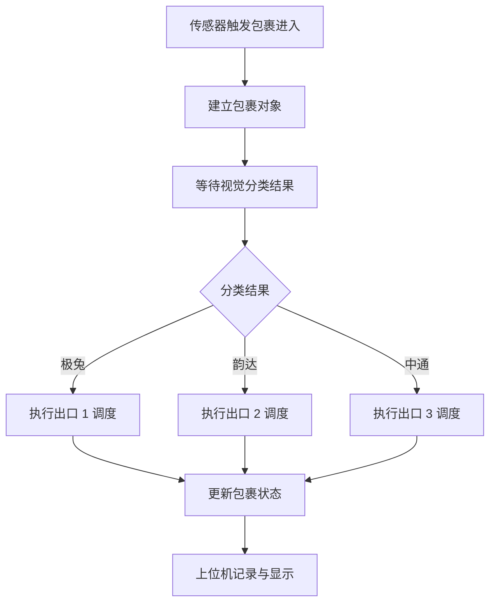

默认调度参数：

| 参数 | 当前值 |
| --- | --- |
| A 电机默认速度 | 60% |
| B 电机默认速度 | 100% |
| C 电机默认速度 | 100% |
| 交接延时 | 100 ms |
| A 传送带超时 | 4500 ms |
| B 传送带超时 | 900 ms |
| C 传送带超时 | 1300 ms |

分拣调度器内部为每个包裹维护一条轨迹记录，最多同时管理 8 个包裹。轨迹中包含包裹编号、类别、当前状态、所在传送带、位置估计、进入当前状态的时间、状态超时、S2/S4 交接就绪时间和 C 传送带退出距离等字段。状态机主要包含 `WAITING_VISION`、`WAITING_AB`、`HOLDING_AT_S2`、`ON_B_TO_CLASS1`、`ON_B_TO_S4`、`HOLDING_AT_S4`、`ON_C_EXIT`、`DONE` 和 `ERROR`。调度器每次收到视觉结果、传感器事件或周期 tick 后都会处理超时、交接和电机输出。

分流路径在调度器中按传送带资源占用控制。包裹到达 S2 后，如果目标为第一类或兜底类，B 传送带正转并送往 class1 出口；如果目标需要继续送往 S4，B 传送带反转或按配置方向运行到 S4，再由 C 传送带完成 class2/class3 的分流。B、C 两条传送带都有 owner 记录，防止两个包裹同时占用同一执行段；如果目标段被占用，包裹会进入 hold 状态，等待交接条件满足。S2/S4 传感器从 active 变为 inactive 后，会启动 100 ms 交接延时，再释放下一段传送带，避免包裹刚离开传感器边缘时立即切换导致机械不稳定。

视觉结果并不是单帧立即定案。真实传感器模式下，S1 上升沿打开一个视觉窗口并创建新包裹，推理任务每次检测到 Logo 后调用 `sorting_sim_control_submit_vision_category()`。控制层先把模型类别映射为分拣类别，其中 0=极兔映射到 CLASS1，1=韵达映射到 CLASS3，2=中通映射到 CLASS2；随后按置信度累加投票，最多 5 次投票后定案。若包裹到达 S2 时仍未得到有效视觉结果，控制层会关闭当前视觉窗口并走视觉失败兜底逻辑，防止包裹长期停在等待状态。

调度器还实现了多级保护。每个状态都有独立超时：A 段等待视觉或等待到达 S2 时使用 A 超时，B 段使用 B 超时，C 段使用 C 超时；如果电机未在运行，超时计时会刷新，避免静止等待被误判。系统支持 `ESTOP` 急停，急停时三路电机全部刹车，解除后重新进入调度。当前源码还保留电机输出使能和传感器输入使能开关，未接硬件时可以关闭真实输出，使用上位机命令验证状态机。

#### 2.3.5 上位机模块

上位机采用 Qt 6 Quick + Qt Network + C++ 开发。系统监听 control 端口 5000 和 image 端口 5001，分别接收遥测/控制数据和 JPEG 图像数据。上位机界面显示板端连接状态、CPU/内存/PSRAM、图像链路健康、最新识别图片、历史包裹记录和电机控制入口。

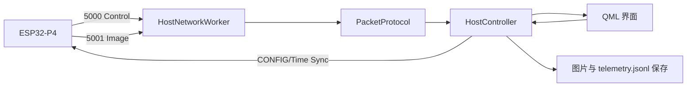

上位机功能：

- 实时接收和显示识别图片。
- 保存每个包裹的检测照片和分拣数据。
- 展示 CPU、内存、PSRAM、FPS、图像编码和发送状态。
- 显示图像链路队列、丢弃、发送耗时等诊断指标。
- 下发时间同步和电机速度控制命令。

板端与上位机之间使用固定 40 字节小端包头，包头包含 magic、version、type、header size、seq、timestamp、payload length、width、height、pixel format 和两个保留字段。板端 magic 为 `0x32505345`，版本为 1；图片包类型为 `0x01`，metrics JSON 为 `0x02`，时间同步为 `0x10`，分拣控制/仿真文本为 `0x12`。图片包的 `reserved` 字段携带类别 ID，`reserved2` 低 8 bit 携带置信度百分比。这样上位机不需要解析图像内容即可更新包裹类别统计和最新置信度。

| 链路 | 端口 | 数据类型 | 实现要点 |
| --- | --- | --- | --- |
| control | 5000 | metrics JSON、时间同步、控制/仿真命令 | 1 s 周期发送遥测；上位机连接后立即发送时间同步 |
| image | 5001 | JPEG 图片包 | 识别成功后发送 640 x 375 带框快照，JPEG quality 85 |

板端图像发送采用生产者/发送者分离。图像生产任务等待视觉侧的带框快照信号量，取到图像后使用硬件 JPEG 编码器生成 JPEG，写入深度为 2 的发送队列；图像发送任务单独维护 image TCP 连接，从队列中取出 ready slot 后按 8 KB chunk 发送。队列会统计 encoded、sent、backpressure drop、stale drop、encode fail、send fail、no frame、最近编码耗时、最近发送耗时和最近 JPEG 字节数，这些字段被写入 metrics JSON 并显示在上位机图像链路健康页面。

上位机采用独立 `HostNetworkWorker` 网络线程监听 `192.168.10.1:5000/5001`，每条连接都有自己的接收缓冲。收到 TCP 字节流后，工作线程先按 40 字节包头寻找合法 magic/version/header size，再根据 `payload_len` 判断是否收到完整包；如果包头不合法则逐字节滑动，避免粘包或断包导致整个连接失效。JPEG 图像会先校验 SOI 标记，再交给 `HostController` 解码、校正颜色通道并保存到 `Documents/ESP32Host/images/frame_xxxxxx.jpg`，同时更新 `latest_preview.jpg`。metrics JSON 会追加保存到 `telemetry.jsonl`，并映射为 CPU、PSRAM、heap、internal RAM、FPS、latency 和图像链路卡片。

控制下发也做了节流处理。上位机把电机速度调整转换为 `CONFIG a_speed=<n> b_speed=<n> c_speed=<n>` 文本，通过 control 链路的 sim line 包发送；同一命令如果与上次值相同则不重复发送，连续滑动时以约 100 ms 间隔合并发送，避免 UI 滑块产生过密 TCP 控制包。时间同步命令使用 JSON 包发送 Unix 毫秒时间和本地时区偏移，板端收到后用于对齐图片与遥测记录时间。

上位机包含四个主要界面：

图：上位机性能总览界面，显示连接状态、CPU/PSRAM/内存占用、运行时长和分类统计。

图：上位机视觉检测界面，显示包裹图像、面单框、Logo 检测框、分类置信度和包裹图像记录。

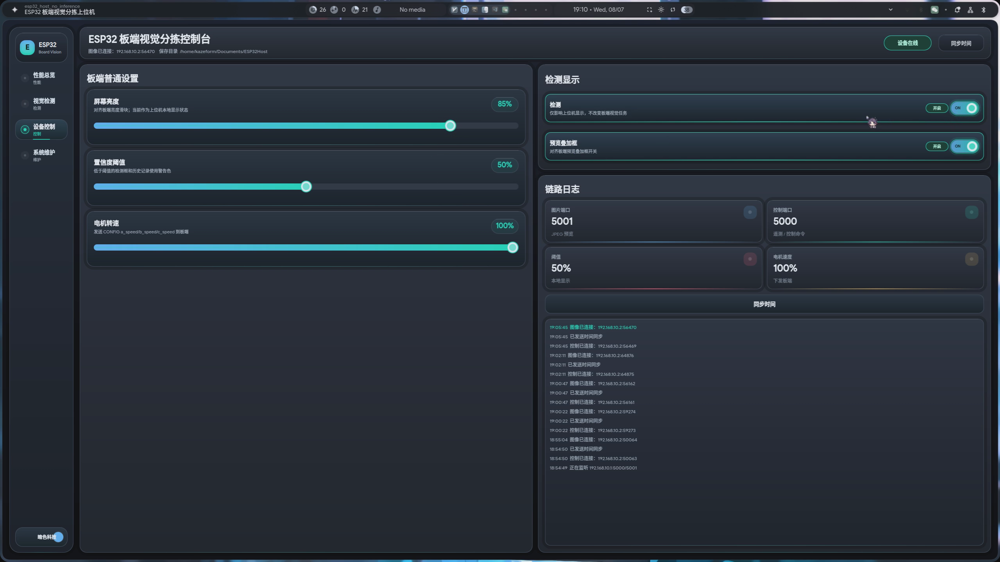

图：上位机设备控制界面，用于调整屏幕亮度、置信度阈值、电机转速和检测显示开关。

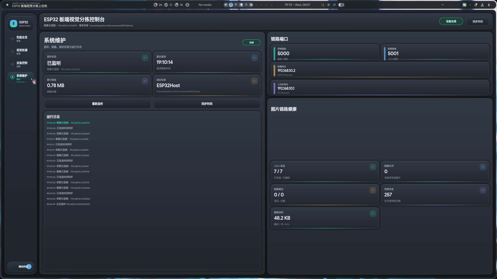

图：上位机系统维护界面，显示监听状态、链路端口、保存目录、运行日志和图片链路健康状态。

#### 2.3.6 显示稳定性与 PSRAM 带宽优化

ESP32-P4 同时承担摄像头采集、LCD 刷新、模型推理、图像编码、网络通信和 UI 更新，多个模块会并发访问 PSRAM。早期联调中，1024 x 600 MIPI DSI 屏幕曾出现不定时蓝屏闪烁，但系统未重启，画面随后恢复。通过日志、按键标记、摄像头开关对照、Framebuffer hash 和官方 DPI underrun 说明进行分析，判断主要原因是 MIPI DSI 连续读取 framebuffer 时被摄像头 DMA、PPA、CPU cache/XIP 或推理访问抢占，导致显示 FIFO 瞬时欠载。

为解决该问题，项目进行了多轮试验，最终采用组合优化方案：

| 优化方向 | 具体措施 | 作用 |
| --- | --- | --- |
| 降低显示带宽压力 | 将 DPI clock 从 52 MHz 降至 26 MHz，使屏幕刷新约为 30 Hz | 降低 DSI 连续读 framebuffer 带宽 |
| 降低摄像头压力 | 降低摄像头帧率和有效处理频率，避免无意义高频采集 | 减少 CSI/V4L2 写 PSRAM 峰值 |
| 优化图像结构 | 使用 ESP-who 风格 ringbuf + zero-copy peek，避免每帧整图 memcpy | 降低 PSRAM 大块读写 |
| 调整仲裁优先级 | 提高 DW-GDMA 读优先级，降低 cache/CPU 普通访问优先级 | 优先保障 DSI framebuffer 读取 |
| 任务调度让位 | 推理和诊断链路接受降帧，显示链路优先 | 避免模型推理压制显示刷新 |

这些优化在源码中对应到三个层面。第一是总线层：LCD 初始化后立即执行 QoS 配置，使 DW-GDMA read=15、write=8，Cache read/write=4，CPU read/write=2。第二是内存层：预览中转缓冲、带框快照缓冲、JPEG 输出缓冲放在 PSRAM，并要求 PPA/JPEG 相关缓冲具备 DMA 能力和 64 字节或 16 字节对齐；推理任务栈则放在内部 SRAM，避免中断上下文写 PSRAM 栈时与 DMA 争用导致死锁。第三是任务层：采集和显示任务固定在 core0，推理任务固定在 core1，系统监视优先级低于业务任务，以 250 ms 周期采样而不是高频轮询。

图像链路也进行了带宽约束。上位机图片不是全帧连续发送，而是在新包裹识别成功后生成一张 640 x 375 带框快照，经过 JPEG 编码后发送；无新包裹时图像生产任务 1 s 超时并记 `no_frame`，不会持续占用网络和编码器。这样的设计牺牲了“全量视频记录”，换取 LCD、推理、网络和分拣调度并行时的稳定性。

经过上述优化，系统从早期“经常蓝屏闪烁”的状态稳定到当前可同时运行 LCD、摄像头、识别、上位机通信和性能监控的状态。

## 第三部分 完成情况及性能参数

### 3.1 整体介绍

目前系统已完成主控、摄像头、传送带、电机驱动、光电传感器、板端 LCD UI 和 PC 上位机的联调。整机能够完成从包裹进入、图像采集、边缘端识别、分拣执行、上位机显示和数据记录的闭环流程。

系统实物与关键局部如下：

### 3.2 工程成果

#### 3.2.1 机械成果

机械结构采用 4080 铝型材框架和三段传送带结构。主传送带用于图像采集与前级输送，分拣传送带用于包裹分流。摄像头固定在传送带上方约 60 cm 位置，通过手动调焦保证面单区域清晰。整体结构便于调节摄像头角度、传感器位置和传送带相对距离，适合比赛现场快速维护。

#### 3.2.2 电路成果

电路系统采用模块化搭建方式，包括 XL4015 降压电源板、3A DC-DC 低压模块、直流电机驱动板、光电传感器和 ESP32-P4 开发套件。各模块通过端子和杜邦线连接，关键电源和地线保持共地。模块化电路降低了制板周期，也便于现场替换和排查故障。

#### 3.2.3 软件成果

板端软件已实现摄像头采集、目标检测、分类结果显示、分拣调度、电机控制、传感器输入、系统性能监视和以太网通信。上位机已实现双 TCP 监听、图像显示、遥测趋势、链路健康显示、包裹历史记录、本地数据保存和控制命令下发。测试中 control/image 链路均能正常工作。上位机界面覆盖性能总览、视觉检测、设备控制和系统维护四类现场工作流，既能用于展示，也能用于联调和故障定位。

从实现完成度看，板端已经形成完整的软件闭环：视觉推理结果会同时进入三个出口，一是保存到显示结果队列供 LCD 画框和文字显示，二是提交给分拣控制层参与视觉投票和状态机调度，三是触发以太网带框快照供上位机保存。系统监视任务产生的同一份 metrics 快照也会同时推送到板端 UI 和上位机 JSON，因此本地显示和 PC 端诊断的指标来源一致。

上位机软件完成了实时链路和离线记录两类功能。实时链路中，网络线程负责监听、拆包和校验，不直接操作 QML；控制器层把图片、类别、置信度、metrics 和日志转换为 QML 属性，界面只负责展示。离线记录中，图片保存为按序号命名的 JPEG 文件，遥测保存为 JSON Lines，后续可直接用于复盘图像发送耗时、内存变化和链路丢包情况。

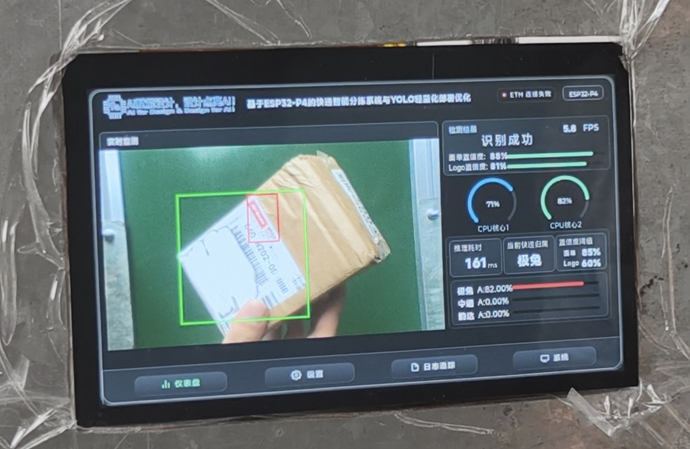

图：板端 LCD 极兔识别实测界面，显示面单框、Logo 框、识别结果、置信度和 CPU 负载。

板端 UI 还包含仪表盘、参数设置、日志追踪和系统资源监控页面，用于在没有上位机时直接观察识别状态、阈值配置、事件记录和资源占用。

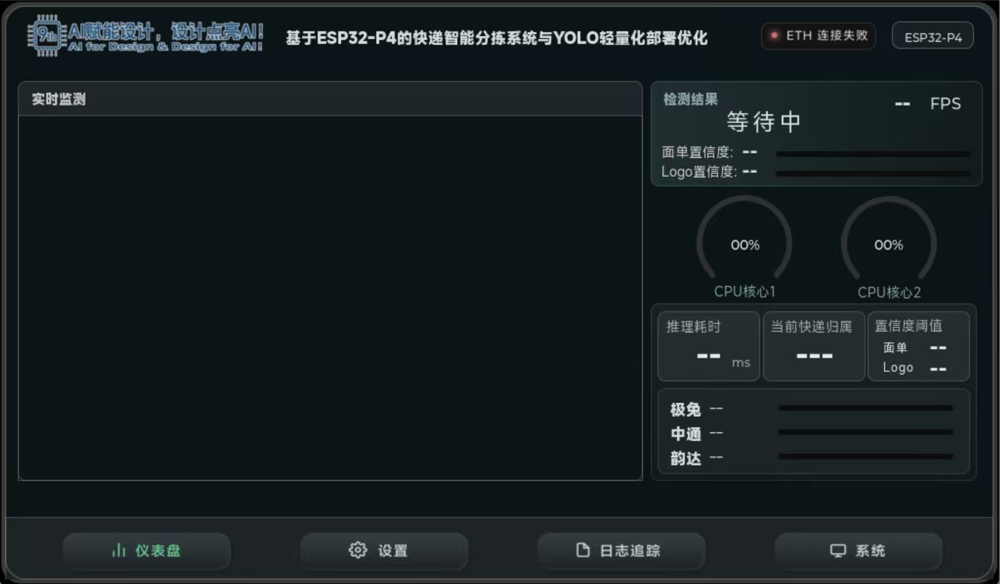

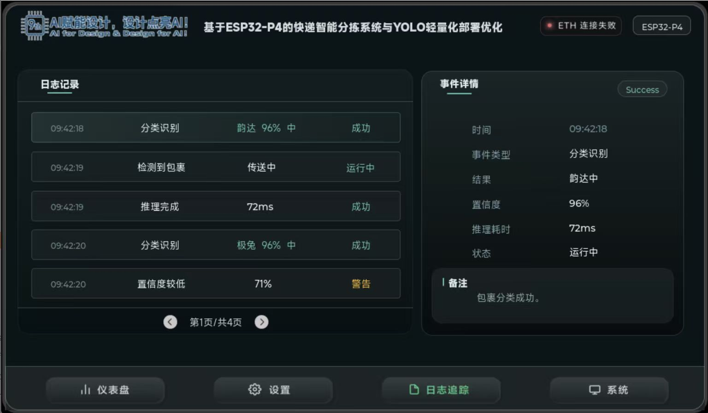

### 3.3 特性成果与量化指标

#### 3.3.1 识别准确率测试

测试在室内自然光照条件下进行，每类快递包裹测试 100 件。测试样本包含不同摆放角度的真实包裹，其中部分样本存在黑色墨痕覆盖 Logo 局部区域的情况。

| 类别 | 测试数量 | 正确识别 | 错分 | 漏检 | 正确率 |
| --- | --- | --- | --- | --- | --- |
| 极兔 | 100 | 98 | 1 | 1 | 98% |
| 韵达 | 100 | 93 | 6 | 1 | 93% |
| 中通 | 100 | 99 | 0 | 1 | 99% |
| 合计 | 300 | 290 | 7 | 3 | 96.7% |

三类包裹的板端识别实测如下：

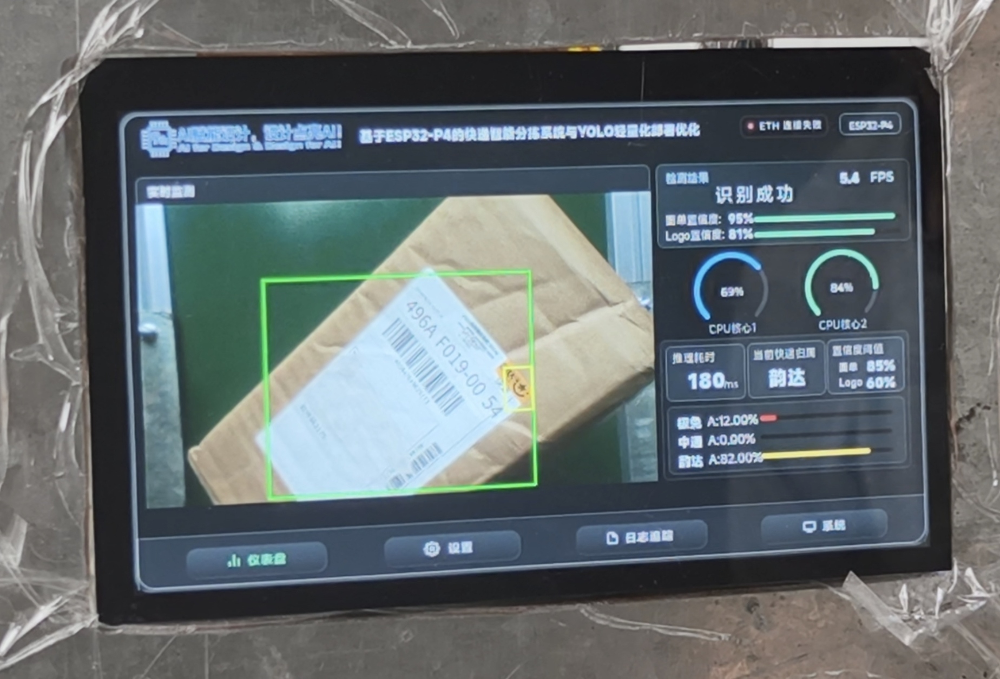

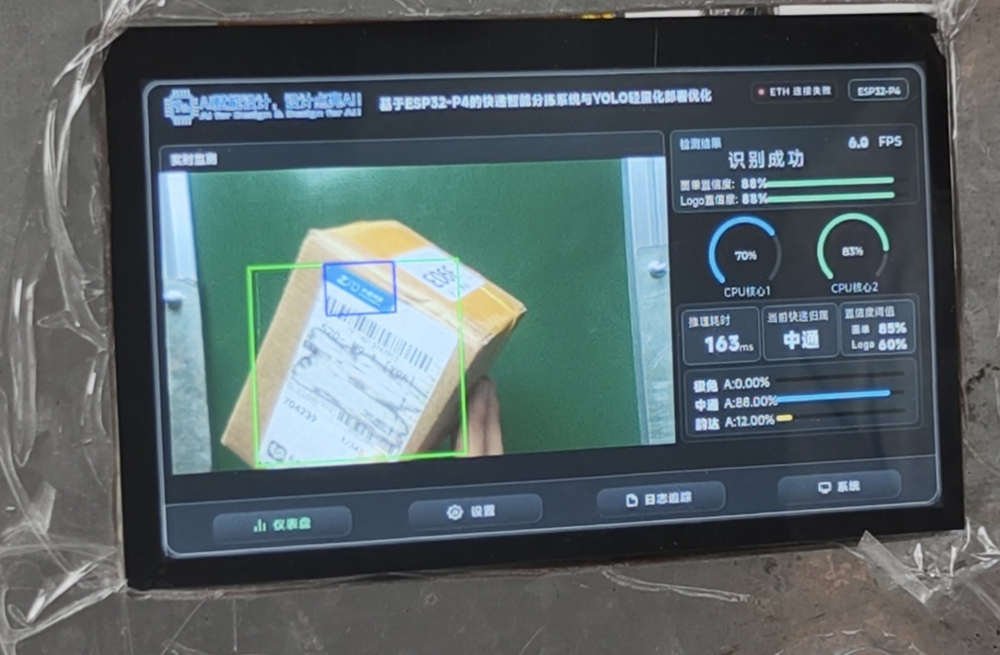

#### 3.3.2 分拣速度与延迟

系统在良好光照条件下可达到每分钟 20 件以上的分拣速度。识别结果到分拣动作触发的延迟小于 0.1 s，机械交接过程设置 0.1 s 安全延时，以提高包裹进入下一段传送带时的稳定性。

实际分拣过程图展示了包裹从主传送带进入端侧检测区域后，根据识别出的快递公司类别进入对应分区的过程。图中标注了极兔、韵达、中通三类分区，对应系统当前支持的三类分拣目标。

#### 3.3.3 通信与上位机记录

上位机通过固定 IP 以太网连接板端，板端地址为 `192.168.10.2`，上位机地址为 `192.168.10.1/24`。control 端口为 `5000/tcp`，image 端口为 `5001/tcp`。测试中图像接收成功率达到 99% 以上，上位机可以显示最新包裹图片、记录历史图像，并持续接收 1 秒周期遥测数据。

遥测数据内容来自板端 `system_monitor_get_metrics()` 和图像队列统计，包含 `cpu_usage`、`cpu0`、`cpu1`、`free_heap`、`min_free_heap`、`free_internal`、`free_psram`、`total_psram`、`largest_free_block`、`image_queue_depth`、`image_encoded`、`image_sent`、`image_drop_backpressure`、`image_drop_stale`、`image_encode_fail`、`image_send_fail`、`image_no_frame`、`last_image_encode_ms`、`last_image_send_ms` 和 `last_image_bytes`。这些指标能够区分“模型推理慢”“JPEG 编码慢”“TCP 发送慢”“没有新包裹快照”和“队列背压”等不同问题，便于现场调试。

#### 3.3.4 模型训练与部署成果

训练阶段累计使用约 5000 张图片构建训练集，并围绕快递包裹的真实拍摄条件调整数据增强策略。训练样本覆盖不同角度、不同面单位置、Logo 遮挡和自然光变化，使模型能够适应现场包裹摆放不完全一致的情况。部署阶段采用 MSE equalization 量化策略，参数为 `(10, 0.1)`，未使用 TQT，未启用 bias correction，以降低模型在嵌入式端压缩部署后的精度下降。最终模型能够在 ESP32-P4 上完成实时推理，并支撑每分钟 20 件以上的分拣速度。

#### 3.3.5 稳定性优化成果

| 项目 | 早期问题 | 优化后效果 |
| --- | --- | --- |
| LCD 显示 | 摄像头、推理、UI 并行时不定时蓝屏闪烁 | 通过降帧、降带宽和仲裁优化修复蓝屏问题 |
| 图像链路 | 高分辨率图像复制会造成 PSRAM 压力 | 使用 zero-copy peek 减少整帧复制 |
| 推理部署 | 量化后可能造成置信度下降 | 筛选 MSE equalization `(10, 0.1)` 作为低损失策略 |
| 上位机链路 | 图像与控制共链路易互相影响 | control/image 分链路，提高遥测和图像传输稳定性 |

## 第四部分 总结

### 4.1 可扩展之处

后续可以从四个方向继续扩展。第一，增加快递类别和样本数量，提升模型对不同面单、不同光照和遮挡情况的泛化能力。第二，加入稳定补光和更完整的相机标定流程，减少环境光变化对识别结果的影响。第三，增加编码器闭环或更精细的速度反馈，使传送带调度从开环时序控制升级为位置闭环控制。第四，设计专用 PCB 和线束，替代当前模块化接线方式，提高整机可靠性和现场维护效率。

### 4.2 心得体会

本作品的研发过程体现了嵌入式 AI 系统从算法验证走向工程闭环的复杂性。单独完成视觉识别并不等于完成分拣系统，真正的难点在于图像采集、模型推理、传感器触发、电机控制、网络传输和界面显示之间的实时协同。ESP32-P4 的资源相对桌面平台有限，因此在模型部署和系统任务安排上需要持续优化，既要保证识别稳定，又要避免图像链路、LCD 刷新和分拣控制互相阻塞。

调试中最典型的问题是 PSRAM 带宽竞争导致的 LCD 蓝屏闪烁。早期系统在摄像头和屏幕并行运行时经常出现蓝屏，但不是系统重启，而是屏幕一瞬间变蓝后恢复。项目围绕这个问题进行了多次试验，包括关闭摄像头、关闭预览、调整色深、降低摄像头帧率、改变取帧结构、检查 framebuffer hash 和分析 MIPI DSI underrun。最终采用降低摄像头帧率、降低显示刷新带宽、使用零拷贝帧总线、优化软件结构和调整 AXI/PSRAM 仲裁优先级等方式，解决了蓝屏问题。这个过程说明嵌入式系统的稳定性往往不是单个模块的问题，而是多个 DMA、cache、CPU 和外设共同竞争资源后的系统问题。

模型训练也带来了很直接的经验。训练集并不是越杂越好，数据质量和场景一致性非常重要。反光严重、Logo 失真或眩光过强的图片会让模型学习到不稳定特征，反而伤害实际识别效果。因此项目在约 5000 张图片中筛选更贴近真实工作环境的样本，并调整数据增强强度。量化阶段也测试了不同策略，最终选择 MSE equalization `(10, 0.1)`，不使用 TQT 和 bias correction，以较低精度损失完成 ESP32-P4 部署。

通过本项目，作品完成了从硬件搭建、模型训练、嵌入式部署、机械分拣到上位机软件设计的完整实践。系统最终能够完成三类快递包裹识别与分拣，说明低功耗边缘设备在小型自动化分拣场景中具有实际应用潜力。

## 第五部分 参考文献

[1] Espressif Systems. ESP32-P4 Series Datasheet.

[2] Espressif Systems. ESP-IDF Programming Guide.

[3] Espressif Systems. ESP-DL User Guide.

[4] Espressif Systems. ESP-IDF MIPI DSI LCD Programming Guide.

[5] LVGL Project. LVGL Documentation.

[6] The Qt Company. Qt 6 Documentation.

[7] SmartSens Technology. SC2336 CMOS Image Sensor Product Brief or Datasheet.

[8] E18-D80NK Infrared Photoelectric Sensor Module Datasheet.

[9] 42GM-775 Planetary DC Gear Motor Product Specification.

[10] XL4015 DC-DC Buck Converter Module Product Specification.
