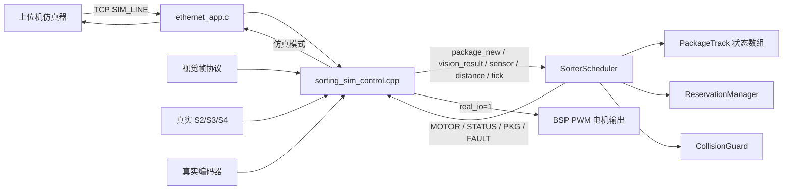
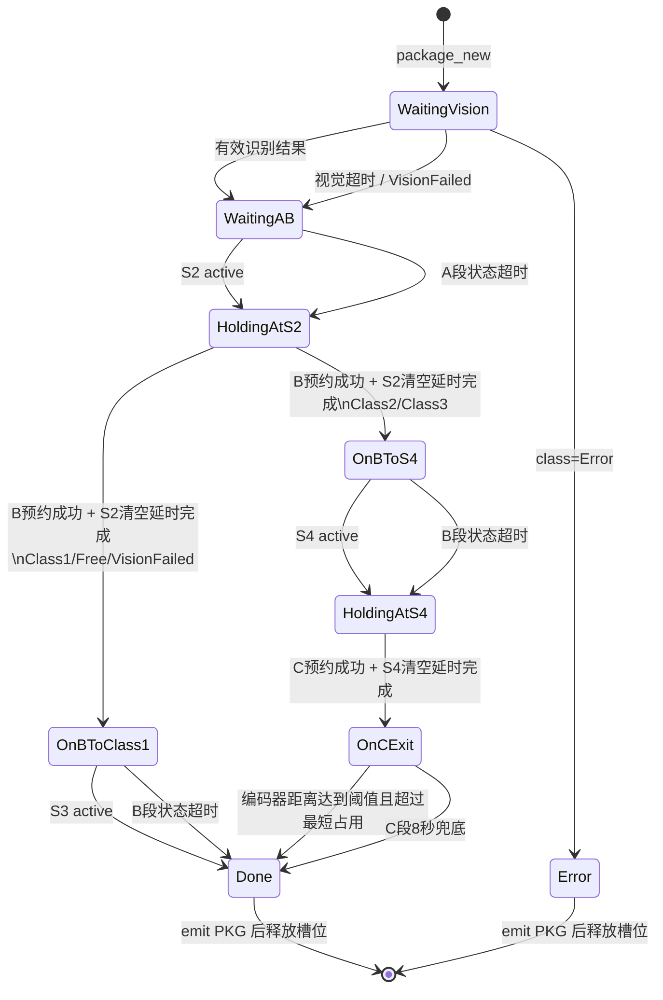

# merge_project 当前分拣算法分析

> 文档日期：2026-06-24
>
> 分析范围：`merge_project` 当前源码中的分拣调度、仿真协议、真实 IO 适配及 Ethernet 调用链。
>
> 目标读者：需要理解系统整体行为、继续调试算法或接入真实硬件的开发人员。

## 1. 结论先行

当前分拣算法的核心不是一个简单的“识别类别后选择电机方向”，而是一个面向多包裹流水线的事件驱动调度器：

- 每个包裹拥有独立的件级状态机；
- A、B、C 三段输送带分别由 1、2、3 号电机驱动；
- B、C 段采用独占预约，防止两个包裹同时占用同一段输送资源；
- S2、S4 负责跨输送带交接，S3 负责 Class1 完成确认；
- Class2 和 Class3 共用 C 段，通过 3 号电机反转/正转分流；
- 传感器缺失时，算法可通过与速度相关的状态超时继续推进；
- C 段优先使用编码器累计距离判断完成，并设置 8 秒时间兜底；
- 调度器既可由上位机仿真事件驱动，也预留了真实 GPIO、PWM、编码器输入路径。

核心实现位于：

```text
components/Ethernet_app/
├── ethernet_app.c
├── sorting_sim_control.cpp
├── include/sorting_sim_control.h
├── include/sorter_core/
│   ├── SorterTypes.hpp
│   ├── SorterScheduler.hpp
│   ├── ReservationManager.hpp
│   └── CollisionGuard.hpp
└── sorter_core/SorterScheduler.cpp
```

其中：

- `SorterScheduler` 是算法核心；
- `sorting_sim_control.cpp` 是协议、并发和真实 IO 适配层；
- `ethernet_app.c` 是 TCP 传输入口；
- BSP 文件负责把抽象电机、传感器、编码器操作落到硬件。

## 2. 机械模型与分类路线

算法假设系统由三段输送带构成：

```text
                  Class1 / Free / VisionFailed
                 ┌────────────────────────────> S3 -> 完成
                 │
入口 -> A带/M1 -> S2 -> B带/M2
                         │
                         └── Class2 / Class3 -> S4 -> C带/M3
                                                      ├── 反转 -> Class2
                                                      └── 正转 -> Class3
```

传感器和电机的逻辑对应关系：

| 对象 | 作用 |
| --- | --- |
| S1 | 视觉窗口中的包裹到达信号；当前主要由 `VISION_FRAME,s1=...` 协议表达 |
| S2 | A 带末端、A→B 交接位置 |
| S3 | B 带 Class1 出口完成传感器 |
| S4 | B 带另一端、B→C 交接位置 |
| M1 | A 带电机，当前调度只使用正转 |
| M2 | B 带电机，正转送往 Class1，反转送往 S4 |
| M3 | C 带电机，反转送 Class2，正转送 Class3 |

类别与路线映射如下：

| 识别类别 | B 带方向 | C 带方向 | 最终出口 |
| --- | --- | --- | --- |
| `Class1` | 正转 | 不使用 | S3 / Class1 |
| `Free` | 正转 | 不使用 | 与 Class1 相同 |
| `VisionFailed` | 正转 | 不使用 | 与 Class1 相同，属于降级路线 |
| `Class2` | 反转 | 反转 | Class2 |
| `Class3` | 反转 | 正转 | Class3 |
| `Error` | 不继续输送 | 不使用 | 直接结束为错误 |

这里有一个重要设计选择：视觉超时或识别失败不会让包裹永久堵塞，而是转成 `VisionFailed`，按 Class1 路线排出。

## 3. 总体架构



### 3.1 分层职责

#### Ethernet 传输层

`ethernet_app.c` 负责：

- 使用固定地址 `192.168.10.2` 接入网络；
- 连接上位机 `192.168.10.1:5000`；
- 接收类型为 `ESP_HOST_TYPE_SIM_LINE (0x12)` 的数据包；
- 调用 `sorting_sim_control_handle_line()`；
- 每 100 ms 调用一次 `sorting_sim_control_tick()`；
- 将调度器输出重新封装成 `SIM_LINE` 发回上位机。

#### 控制适配层

`sorting_sim_control.cpp` 负责：

- 解析文本命令；
- 管理视觉识别窗口和自动包裹 ID；
- 将仿真事件转换成调度器方法调用；
- 用互斥锁串行化 TCP 任务、真实 IO 任务对调度器的访问；
- 在真实 IO 模式下轮询传感器和编码器；
- 将调度器的 `MOTOR` 命令同时映射到 BSP；
- 将状态、包裹和故障信息发送给上位机。

#### 核心调度层

`SorterScheduler` 负责：

- 保存最多 8 个活动包裹；
- 执行件级状态转换；
- 决定每个电机何时启动、停止和换向；
- 处理 B/C 输送带预约；
- 处理 S2/S4 交接延时；
- 处理传感器丢失和 C 段完成兜底；
- 抑制重复电机命令；
- 输出可观察的 `STATUS`、`PKG`、`FAULT`。

## 4. 关键数据结构

### 4.1 包裹跟踪 `PackageTrack`

每个活动包裹由一个 `PackageTrack` 表示，关键字段包括：

| 字段 | 含义 |
| --- | --- |
| `id` | 包裹唯一 ID，算法同时用它表达先后顺序 |
| `cls` | 识别类别 |
| `state` | 当前件级状态 |
| `belt` | 当前所在 A/B/C 输送带 |
| `pos_mm` | 估算位置；当前实现仅在少数节点赋值，没有连续积分 |
| `state_enter_ms` | 进入当前状态的时间 |
| `state_timeout_ms` | 当前状态的丢件超时时间 |
| `handoff_ready_ms` | S2/S4 传感器释放后的交接延时截止时间 |
| `c_start_dist_mm` | 进入 C 段时的编码器距离基准 |
| `c_busy_until_ms` | C 段最短占用截止时间 |
| `c_fallback_until_ms` | C 段无距离确认时的最终兜底时间 |
| `c_distance_started` | 是否已经取得 C 段距离基准 |
| `occupied` | 当前数组槽位是否有效 |

调度器使用固定长度数组：

```cpp
std::array<PackageTrack, kMaxPackages> tracks_;
```

`kMaxPackages = 8`。固定数组避免运行期动态分配，适合嵌入式实时控制；代价是活动包裹超过 8 个时产生 `queue_full` 故障。

### 4.2 配置 `SorterConfig`

当前默认参数：

| 参数 | 默认值 | 用途 |
| --- | ---: | --- |
| `package_length_mm` | 120 mm | 包裹长度 |
| `safe_gap_mm` | 80 mm | A 带防碰撞安全间距 |
| `a_start_to_vision_mm` | 300 mm | A 带入口到视觉区距离 |
| `a_vision_to_b_mm` | 520 mm | 视觉区到 S2/B 段距离 |
| `c_exit_distance_mm` | 360 mm | C 段判定完成的累计距离 |
| `c_min_busy_ms` | 2500 ms | C 段允许完成前的最短占用时间 |
| `c_fallback_busy_ms` | 8000 ms | C 段无有效距离时的完成兜底 |
| `handoff_delay_ms` | 1000 ms | S2/S4 释放后的交接延时 |
| `lost_timeout_min_ms` | 3000 ms | 高速时状态超时下限 |
| `lost_timeout_max_ms` | 6000 ms | 低速时状态超时上限 |
| `motor_a_speed_percent` | 30% | M1 默认速度 |
| `motor_b_speed_percent` | 35% | M2 默认速度 |
| `motor_c_speed_percent` | 35% | M3 默认速度 |

上位机可以通过 `CONFIG` 命令动态调整三路速度、交接延时和丢件超时范围。

### 4.3 资源预约 `ReservationManager`

预约器只保存两个独占 owner：

```text
B owner = 当前独占 B 带的包裹 ID
C owner = 当前独占 C 带的包裹 ID
```

规则非常直接：

- owner 为 0 时，任意包裹可以预约；
- owner 等于当前包裹时，允许重复确认；
- owner 属于其他包裹时，预约失败；
- 包裹完成、出错或转移离开相应区段时释放预约。

该设计解决的是“共享输送带方向冲突”。例如一个 Class1 要求 B 带正转，而另一个 Class2 要求 B 带反转。如果不做独占预约，两个包裹会互相破坏路线。

## 5. 件级状态机

### 5.1 状态定义

| 状态 | 含义 |
| --- | --- |
| `Empty` | 数组槽位未使用 |
| `WaitingVision` | 包裹已创建，等待视觉分类 |
| `WaitingAB` | 已分类，正在 A 带前往 S2 |
| `HoldingAtS2` | 已到 S2，等待或执行 A→B 交接 |
| `OnBToClass1` | B 带正转，前往 S3 |
| `OnBToS4` | B 带反转，前往 S4 |
| `WaitingBC` | 当前枚举保留，主流程未实际使用 |
| `HoldingAtS4` | 已到 S4，等待或执行 B→C 交接 |
| `OnCExit` | 已进入 C 带，前往 Class2 或 Class3 出口 |
| `Done` | 完成；输出事件后槽位立即释放 |
| `Error` | 错误结束；输出事件后槽位立即释放 |

### 5.2 主状态图



### 5.3 状态转换统一入口

状态转换通过 `transition_state()` 完成：

1. 写入新状态；
2. 记录进入时间；
3. 根据状态和当前电机速度计算超时时间。

这使状态机天然携带超时恢复信息，而不是在每个分支中维护独立定时器。

## 6. 三条典型分拣路径

### 6.1 Class1 路径

```text
WaitingVision
  -> WaitingAB
  -> HoldingAtS2
  -> OnBToClass1
  -> Done
```

关键动作：

1. S2 到达后停止 M1；
2. 预约 B 带正转；
3. S2 释放后等待 `handoff_delay_ms`；
4. 状态转为 `OnBToClass1`，M2 正转；
5. S3 激活后停止 M2、释放 B 预约并完成包裹。

`Free` 和 `VisionFailed` 使用同一路径。

### 6.2 Class2 路径

```text
WaitingVision
  -> WaitingAB
  -> HoldingAtS2
  -> OnBToS4
  -> HoldingAtS4
  -> OnCExit
  -> Done
```

关键动作：

1. 在 S2 预约 B 带反转；
2. M2 反转，将包裹送到 S4；
3. 在 S4 停止 M2并预约 C 带反转；
4. S4 释放并完成交接延时后，释放 B 预约；
5. M3 反转，将包裹送往 Class2；
6. 编码器累计距离达到 360 mm，且 C 段已占用至少 2500 ms 后完成；
7. 若没有有效距离确认，进入 C 段 8000 ms 后兜底完成。

### 6.3 Class3 路径

Class3 与 Class2 的状态路径完全相同，唯一差异是进入 C 段后 M3 正转。

这说明分类决策集中在两个方向选择点：

```text
S2：决定 M2 正转还是反转
S4：决定 M3 正转还是反转
```

## 7. 调度算法的关键设计

### 7.1 事件驱动与周期调度结合

调度器在以下事件到来时立即工作：

- 新包裹；
- 视觉结果；
- 传感器边沿；
- 编码器距离；
- 急停切换。

同时，TCP 任务每 100 ms 调用 `tick()`，用于：

- 检查状态超时；
- 完成交接延时；
- 尝试释放在 S2/S4 等待资源的包裹；
- 重新决定 A 带是否运行。

因此，即使某次事件没有触发完整动作，周期 tick 也会继续推动系统。

### 7.2 B/C 段独占，而不是按方向共享

预约器记录了方向，但当前可用性判断实际只看 owner，不允许两个同方向包裹同时共享 B 或 C。

这是偏保守的安全策略：

- 优点：行为简单、方向不会冲突、易于验证；
- 代价：吞吐量低于“同方向批量放行”策略。

### 7.3 S2/S4 两阶段交接

以 S2 为例：

1. S2 激活：包裹进入 `HoldingAtS2`，M1 停止；
2. 若 B 空闲，先预约 B，并强制 M1 正转、M2 停止；
3. S2 释放：设置 `handoff_ready_ms = now + handoff_delay_ms`；
4. 延时到达：才正式将包裹标记为位于 B 带，并启动 M2。

S4 使用相同结构。

这种“两阶段交接”避免传感器刚释放就立即启动下游，给机械结构留出包裹完全跨越交界位置的时间。

### 7.4 速度相关的丢件超时

状态超时按速度线性计算：

```text
timeout = max_timeout
          - (max_timeout - min_timeout) * speed_percent / 100
```

默认范围为 3000～6000 ms：

| 速度 | 状态超时 |
| ---: | ---: |
| 0% | 6000 ms |
| 30% | 5100 ms |
| 35% | 4950 ms |
| 100% | 3000 ms |

超时计时只在对应电机实际运行时推进；电机停止时会重置 `state_enter_ms`。因此资源等待和机械暂停不会被误判为丢件。

### 7.5 传感器丢失后的恢复策略

| 丢失位置 | 当前恢复行为 |
| --- | --- |
| 视觉结果丢失 | 标记 `VisionFailed`，继续走 Class1 路线 |
| S2 丢失 | 假定已到 S2，停止 M1并尝试 A→B |
| S2 释放边沿丢失 | 超时后直接完成 S2 交接 |
| S3 丢失 | 停止 M2，将 Class1 包裹判定完成 |
| S4 丢失 | 假定已到 S4并尝试 B→C |
| S4 释放边沿丢失 | 超时后直接完成 S4 交接 |
| C 编码器距离丢失 | 进入 C 段 8 秒后兜底完成 |

这些策略优先保证流水线不永久锁死，但也意味着“超时完成”不等价于真实物理位置已经确认。现场系统应记录并统计 `reason=timeout_*`。

### 7.6 电机命令去重

`emit_motor()` 保存每台电机的最近命令。方向和速度完全相同时不重复输出，除非调用方设置 `force=true`。

S2/S4 开始交接时会强制输出，是为了确保交接动作不被历史命令去重。

## 8. A 带调度与碰撞保护

`schedule()` 当前主要决定 M1 是否运行：

1. 如果 S2 有未成功占用 B 带的包裹，则 A 带停止；
2. 否则遍历 A 带上的包裹；
3. 只要存在可移动包裹，M1 正转；
4. 如果 A 带没有包裹，M1 仍保持正转，等待新包裹进入；
5. 如果有包裹但都不满足安全距离条件，M1 停止。

理论安全间距为：

```text
package_length_mm + safe_gap_mm = 120 + 80 = 200 mm
```

但当前实现存在一个必须注意的限制：

- `pos_mm` 没有根据 A 带速度或编码器进行连续更新；
- 新包裹位置从 0 开始；
- 只有到达 S2或超时假定到达 S2时，位置被设置为 820 mm；
- `CollisionGuard::can_start_on_a()` 当前没有被调度器调用；
- 因此多包裹 A 带防碰撞模型目前只是部分实现，不能视为真实空间跟踪。

当前通过上位机仿真验证的是状态调度和资源交接，不是基于真实位置积分的严格防碰撞。

## 9. 视觉窗口与包裹创建

`sorting_sim_control.cpp` 在调度器外维护一个简化视觉窗口：

```text
s_vision_s1_active
s_vision_package_id
s_vision_classified
s_vision_failed_seen
```

处理逻辑：

1. `s1` 从 0 变为 1时，认为新包裹进入视觉窗口；
2. 自动分配递增 ID；
3. 调用 `package_new(id)`；
4. 窗口内首次出现有效类别时调用 `vision_result()`；
5. `class=error` 或包裹到达 S2仍未完成分类时，转为 `VisionFailed`；
6. 同一窗口完成分类后，后续帧不重复提交分类结果。

需要明确：当前本地 `vision_app` 没有直接调用 `SorterScheduler`。实际接入链路仍然是 `VISION_FRAME` 文本协议进入 `sorting_sim_control_handle_line()`。如果目标是完全端侧闭环，需要新增本地视觉结果到该接口或调度器的直接桥接。

## 10. 关键调用链

### 10.1 TCP 仿真输入

```text
tcp_client_task()
  -> poll_incoming_packets()
    -> process_rx_packet()
      -> sorting_sim_control_handle_line()
        -> SorterScheduler::{package_new|vision_result|sensor|distance|estop}
          -> service_state_timeouts()
          -> service_pending_transfers()
          -> schedule()
          -> emit_motor/status/package/fault()
            -> scheduler_send()
              -> send_sim_line_packet()
                -> send_packet()
```

### 10.2 周期推进

```text
tcp_client_task() 每100ms
  -> sorting_sim_control_tick()
    -> SorterScheduler::tick()
      -> service_state_timeouts()
      -> service_pending_transfers()
      -> schedule()
```

### 10.3 真实传感器输入

```text
real_io_task() 每10ms
  -> bsp_sort_sensor_get_state()
  -> 20ms软件消抖
  -> SorterScheduler::sensor(sensor_id, stable_state, 0)
```

真实传感器不提供包裹 ID，调度器按对应状态中 ID 最小的包裹进行匹配。因此算法依赖“包裹 ID 顺序与物理先后顺序一致”。

### 10.4 真实编码器输入

```text
encoder_sample_timer_cb() 每100ms
  -> 缓存 encoder 0 速度 cm/s

real_io_task() 每10ms
  -> bsp_encoder_get_speed_cm_s(encoder 0)
  -> 对 |speed| 按时间积分得到累计 mm
  -> SorterScheduler::distance(3, accumulated_mm)
```

当前 M3 距离使用编码器 0 的速度积分，而不是直接读取位置计数。积分使用绝对速度，因此只统计路程，不区分正反方向，适合当前 Class2/Class3 共用同一距离阈值的逻辑。

### 10.5 电机输出

```text
SorterScheduler::emit_motor()
  -> scheduler_send()
    -> apply_motor_command_line()
      -> bsp_motor_set_speed_direction(motor_id - 1, speed, direction)
```

调度器使用电机 ID 1～3，BSP 使用数组下标 0～2，适配层进行了减一转换。

## 11. 协议接口

### 11.1 输入命令

| 命令 | 作用 |
| --- | --- |
| `CONFIG,...` | 修改速度、超时、交接延时和真实 IO 开关 |
| `PACKAGE_NEW,id=n` | 手动创建包裹 |
| `VISION_RESULT,id=n,class=x` | 为指定包裹提交分类 |
| `VISION_FRAME,s1=0/1,free=0/1,class=x` | 按视觉帧驱动自动建包和分类 |
| `SENSOR,id=n,state=0/1,package=x` | 注入传感器状态 |
| `DISTANCE,motor=3,dist=x` | 注入 C 段累计距离 |
| `ESTOP,state=0/1` | 急停或解除急停 |
| `RESET` | 清空包裹、预约和视觉窗口 |
| `HELP` | 返回命令帮助 |

### 11.2 输出消息

| 消息 | 示例用途 |
| --- | --- |
| `MOTOR` | 电机方向和速度命令 |
| `STATUS` | 活动包裹数、系统状态、动作原因 |
| `PKG` | 包裹 ID、输送带、状态和类别快照 |
| `FAULT` | 队列满、重复 ID、传感器错配等故障 |

典型输出：

```text
MOTOR,id=2,dir=reverse,speed=35
STATUS,packages=2,state=running,reason=b_to_c
PKG,id=7,belt=B,pos=0.0,state=on_b_to_s4,class=class2
FAULT,code=sensor_without_package,package=0,sensor=4
```

## 12. 急停行为

`ESTOP,state=1`：

- 设置 `estop_ = true`；
- 设置 `paused_after_estop_ = true`；
- 向三台电机发出 `brake`；
- 停止 tick 推进和状态超时。

`ESTOP,state=0`：

- 清除 `estop_` 和暂停标记；
- 先向三台电机发出 `stop`；
- 重新处理超时和调度；
- 原有包裹状态和预约不清空。

因此解除急停属于“从原状态继续”，不是复位。若现场情况已经与软件状态不一致，应使用 `RESET` 并进行人工清线。

需要注意真实 IO 映射：`apply_motor_command_line()` 当前把 `stop` 和 `brake` 都转换成速度 0，没有把调度器的 `Brake` 语义映射为 BSP 中“两路 3.3V”的硬件急刹方式。

## 13. 并发模型

调度器可能被两个任务访问：

- `eth_tcp`：接收仿真命令并每 100 ms tick；
- `sort_real_io`：每 10 ms提交真实传感器和编码器事件。

`sorting_sim_control.cpp` 使用 FreeRTOS mutex 保护：

- 调度器状态；
- 下游发送回调；
- 视觉窗口和真实 IO 控制状态。

所有调度器方法都在锁内调用。调度器内部本身不加锁，因此不能绕过控制适配层从其他任务直接并发调用。

## 14. 当前实现的已知边界

### 14.1 真实硬件尚未完成配置

当前配置中：

```text
CONFIG_SORT_SENSOR_S2_GPIO=-1
CONFIG_SORT_SENSOR_S3_GPIO=-1
CONFIG_SORT_SENSOR_S4_GPIO=-1
```

`bsp_motor.c` 中三台电机的 PWM GPIO 宏也全部为 `-1`。

因此：

- 2026-06-23 的 20 包裹验证证明的是上位机仿真链路和调度逻辑；
- 不代表真实传感器、电机方向、PWM 极性和机械距离已经验证；
- `CONFIG,...,real_io=1` 时，电机初始化当前会失败并禁用真实电机输出。

### 14.2 本地视觉尚未直接闭环

视觉应用与调度器之间没有直接函数调用。当前调度器的自动建包依赖外部 `VISION_FRAME` 输入。

### 14.3 A 带位置模型不完整

`CollisionGuard` 已存在，但 `pos_mm` 不连续更新，无法形成严格的多包裹物理间距保护。

### 14.4 `WaitingBC` 是未使用状态

枚举、查询函数和超时分支中保留了 `WaitingBC`，但当前主流程不会进入该状态。阅读状态机时不应把它误认为现有必经节点。

### 14.5 部分故障枚举尚未主动发出

`TransferTimeout` 和 `Estop` 存在于 `FaultCode`，但当前超时主要通过 `STATUS reason=timeout_*` 表达，急停也只发 `STATUS`，没有对应 `FAULT`。

### 14.6 旧合并日志与当前代码存在差异

`merge_log.md` 写于 2026-06-23，其中提到恢复依赖 `PACKAGE_LOST`。当前代码已经：

- 明确拒绝 `PACKAGE_LOST`，返回 `legacy_package_lost_rejected`；
- 增加了各状态的速度相关超时；
- 增加了 C 段 8 秒兜底；
- 解除急停后会恢复调度。

分析当前行为时应以源码为准。

### 14.7 配置更新的范围

`CONFIG` 当前只开放：

- A/B/C 速度；
- `handoff_delay_ms`；
- 丢件超时上下限；
- `real_io`。

机械距离、安全间距、C 段最短占用和兜底时间仍使用编译期默认值。

## 15. 已有验证

根据 `merge_log.md`，2026-06-23 已完成：

- `idf.py build`；
- 固件烧录；
- TCP 上位机无界面仿真；
- 20 个包裹完成 20/20；
- 类别分布为 Class1 7件、Class2 7件、Class3 6件；
- 异常扫描未发现 `FAULT`、stall、协议不同步或 timeout。

这次验证能够说明：

- TCP 协议接入有效；
- 多包裹状态推进有效；
- B/C 预约没有造成死锁；
- 三条分类路线都能完成；
- 输出行为与已知基线基本一致。

它不能说明：

- 真实 GPIO 配置正确；
- 真实传感器极性和消抖满足现场要求；
- 实际电机正反转方向与抽象方向一致；
- 真实包裹间距不会碰撞；
- 编码器距离标定正确；
- 急停具备所需的硬件安全等级。

## 16. 阅读和修改代码的建议顺序

如果要继续维护算法，建议按以下顺序阅读：

1. `SorterTypes.hpp`：先理解状态、类别、配置和包裹字段；
2. `SorterScheduler.cpp` 的 `package_new()`、`vision_result()`、`sensor()`、`distance()`；
3. `release_s2_to_b()`、`release_s4_to_c()` 和两个 `complete_*_handoff()`；
4. `service_pending_transfers()`；
5. `service_state_timeouts()`；
6. `schedule()`；
7. `ReservationManager.hpp`；
8. `sorting_sim_control.cpp` 的协议和真实 IO 适配；
9. `ethernet_app.c` 的 TCP 调用链；
10. 最后检查 BSP 引脚、PWM 极性和编码器标定。

## 17. 后续改进优先级

### P0：真实硬件闭环

- 配置三台电机 PWM GPIO；
- 配置 S2/S3/S4 GPIO；
- 校验传感器有效电平；
- 校验 M1/M2/M3 的正反转物理方向；
- 明确 `Brake` 与 `Stop` 的硬件映射；
- 校准 C 段编码器距离。

### P1：端侧视觉直接接入

- 在本地视觉稳定识别事件中调用统一控制接口；
- 保留 TCP 仿真作为测试入口，但不让生产运行依赖上位机生成 `VISION_FRAME`；
- 明确 S1 来自真实传感器还是视觉 ROI 占用状态。

### P1：完善位置和防碰撞模型

- 为 A 带包裹持续更新 `pos_mm`；
- 接入 A 带编码器或基于速度和时间积分；
- 使用 `can_start_on_a()` 控制新包裹准入；
- 增加位置模型失真后的校正点；
- 对超时恢复增加告警计数，避免静默掩盖传感器故障。

### P2：提高吞吐量

- 评估 B/C 同方向包裹是否允许批量共享；
- 将独占 owner 扩展为有序队列或区段占用模型；
- 在保证机械间距的前提下减少 S2/S4 等待时间。

### P2：增强可诊断性

- 为每次状态转换输出统一事件；
- 区分“传感器确认完成”和“超时推定完成”；
- 输出预约 owner 和等待队列；
- 将 `TransferTimeout` 真正接入 `FAULT`；
- 统计视觉降级、S2/S3/S4 超时、C 兜底次数。

## 18. 一句话理解当前算法

当前算法通过“每件包裹一个状态机、B/C 输送带独占预约、S2/S4 两阶段交接、传感器事件与超时双通道推进”，在最多 8 个并发包裹下完成 Class1、Class2、Class3 三路分拣；仿真调度链路已经验证，但真实硬件配置、端侧视觉直连和连续位置防碰撞仍是下一阶段工作的重点。
