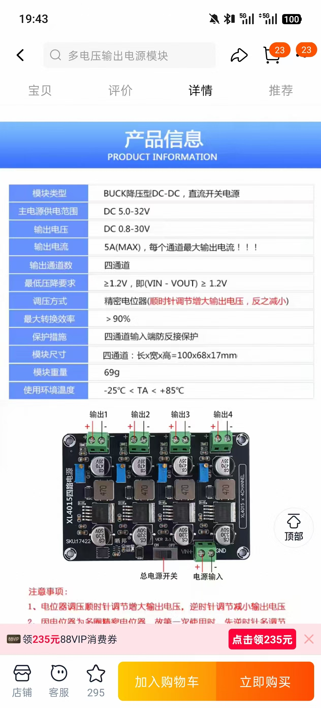
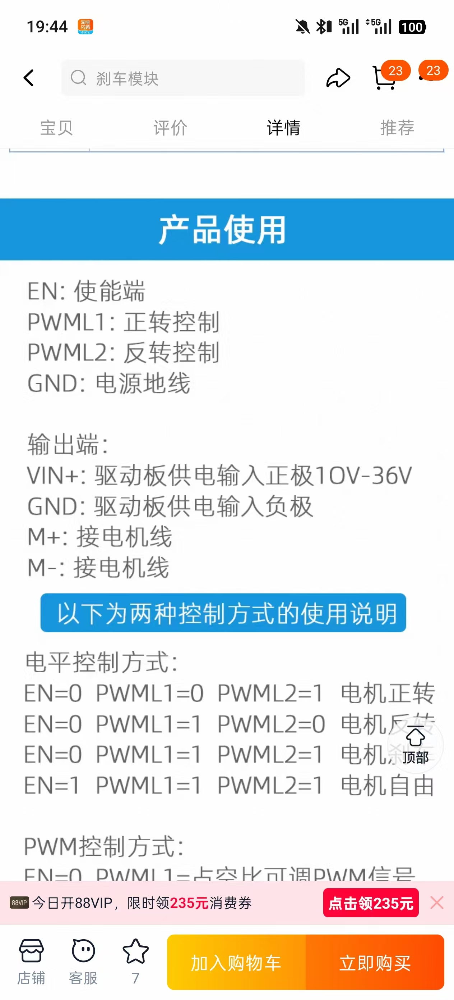
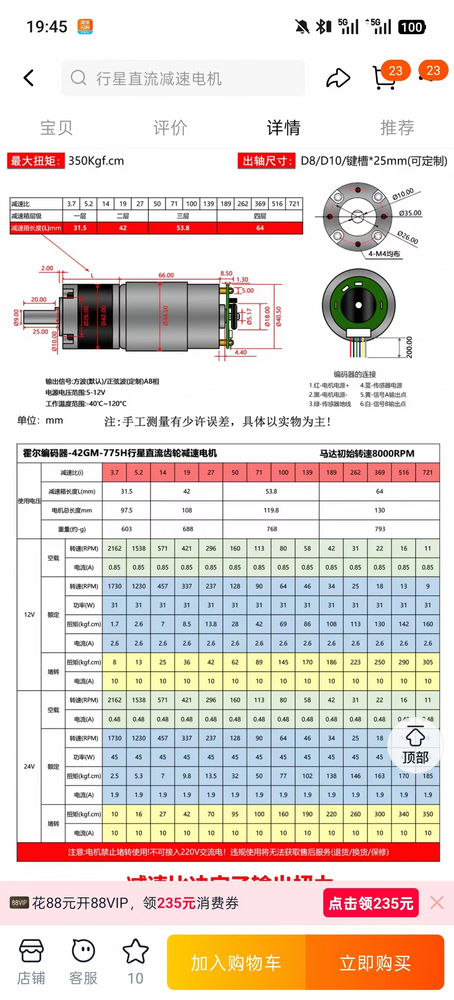
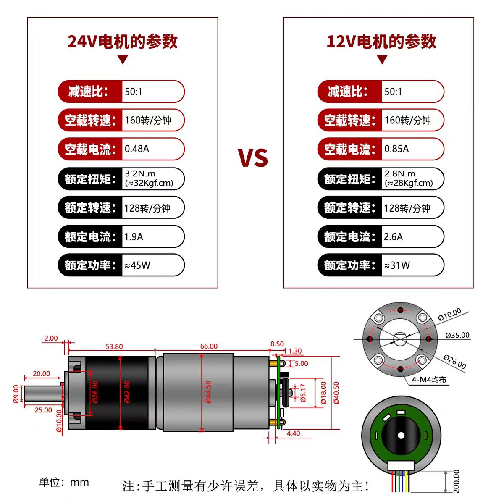
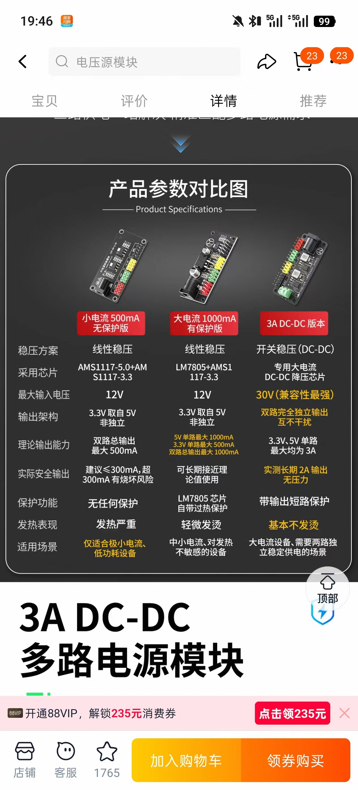

光电传感器：E18-D80NK光电开关漫反射式红外感应器避障传感器感应模块（DC3.3V PNP 常开）

系统框图 
/home/kazeform/.local/share/WeChat_Data/xwechat_files/wxid_gw15cxqq6e6j22_e673/temp/RWTemp/2026-07/cbbef14d62c3cc95292a50ded739cfa4.jpg

24V 转 12V 电源板：四通道 XL4015 24V 转 12V 电源板

【淘宝】7天无理由退货 https://e.tb.cn/h.RyBc1WlZCt2UcRw?tk=i9tQgMWtnEY CZ225 「LM2596多路输出电源模块DCDC降压可调电压4路直流大功率24V转12V」
点击链接直接打开 或者 淘宝搜索直接打开

直流电机驱动板：450W大功率直流电机驱动板模块 可满PWM 正反转刹车12V

直流电机：8k-42-775霍尔编码器行星直流减速电机12v24正反转大扭力调速马达

无编码器 四个光电传感器 无自行绘制电路板 摄像头可调焦距 电机为 160rpm 12V 直流电机 

HU287 「DC电源模块3.3V 5V 12V多路输出 电压转换模块 12V转3.3V 5V 12v」使用的版本为 3A DC-DC 版本

  

 

 摄像头：200万像素2MP高清1080P SC2336摄像头MIPI 接口  100° 广角 可调焦

 
a传送带 100cm*40cm bc传送带 40乘以40cm

作品效果 能够成功分拣 在光线条件良好的情况下 正确率95% 以上。分拣速度每分钟20件以上。