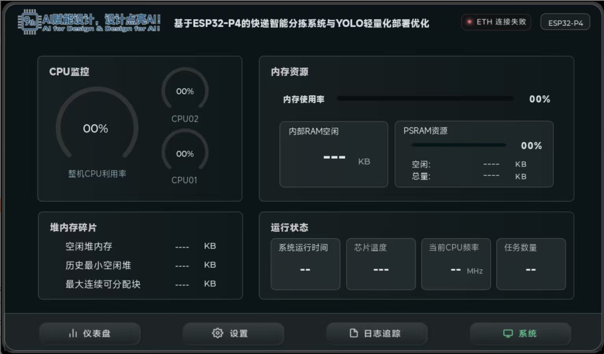

# 嵌入式边缘 AI 智能分拣系统

## 摘要

本作品面向末端快递分拣场景，设计并实现了一套以 ESP32-P4 为核心的嵌入式边缘 AI 智能分拣系统。系统以三段传送带为执行载体，使用 SC2336 MIPI-CSI 摄像头采集包裹图像，利用光电传感器检测包裹到位状态，在 ESP32-P4 端完成图像采集、两级视觉识别、分拣调度、电机 PWM 控制、LCD 人机交互和以太网通信。视觉部分采用两级 ESP-Detection 模型：一级模型在 224×224 输入下定位包裹面单，二级模型对裁剪后的面单区域进行 224×224 快递公司类别识别，实现极兔、韵达和中通三类包裹的本地识别。

系统通过 LVGL 构建 1024×600 LCD 图形界面，实时显示检测画面、识别类别、置信度、推理时间和系统资源信息，并支持本地调整运行参数。ESP32-P4 通过以太网向 Qt 上位机上传包裹识别类别、置信度、分拣时间、分拣结果、运行状态及单包裹 JPEG 图像；上位机完成实时展示、历史数据查询、运行状态监测和远程参数控制。上位机进一步调用云端大模型服务，对包裹类型分布、异常件比例、分拣效率和设备运行状态进行分析，自动生成数据报告与优化建议，并将结构化调速和运行控制命令下发至端侧，形成“边缘 AI 感知、本地自动分拣、云端智能分析”的协同闭环。

在室内自然光条件下，系统使用真实快递包裹进行 300 件测试，包裹包含不同摆放角度及局部 Logo 被黑色墨痕遮挡的情况。系统正确识别 290 件，综合正确率为 96.7%，端侧推理延迟小于 0.1 s，分拣速度达到每分钟 20 件以上，图像接收成功率超过 99%。

**关键词：** ESP32-P4；边缘人工智能；快递分拣；两级视觉识别；云端协同

## 第一部分 作品概述

### 1.1 功能与特性

本系统实现包裹自动识别、自动分拣、板端可视化、上位机监控和云端智能分析。包裹进入主传送带后，光电传感器产生到位触发信号，摄像头采集包裹图像，ESP32-P4 在本地完成面单定位与快递公司识别。识别结果进入分拣调度器，调度器根据包裹类别、传感器到位事件和传送带状态控制三路直流减速电机，将包裹输送至对应出口。

系统的核心特性如下：

- 边缘端识别：图像采集、模型推理和分拣决策均在 ESP32-P4 本地完成，减少图像上传和云端计算依赖。
- 两级识别：先定位面单区域，再识别面单中的快递公司信息，降低复杂背景对分类结果的干扰。
- 自动分拣：传感器检测、分拣状态机与三路电机 PWM 控制协同执行，实现连续包裹输送和分类分流。
- 实时交互：LCD 实时显示检测框、类别、置信度、推理时间和运行状态；本地可调节视觉阈值及相关运行参数。
- 云边协同：上位机接收端侧数据、保存历史记录并调用云端大模型服务；云端分析结果以结构化指令形式参与设备调速与运行控制。

图 1 系统整体正面实拍图

### 1.2 应用领域

本系统适用于快递末端网点、小型仓储分拣、校园物流实训和嵌入式 AI 自动化教学等场景。对于小批量、多类别且需要快速部署的包裹分流任务，系统使用嵌入式硬件完成视觉识别和执行控制，能够减少人工识别、记录和搬运工作。边缘端具备独立识别与分拣能力，在网络暂时不可用时仍可完成本地核心作业；网络正常时，上位机和云端平台提供数据追溯、统计分析和远程优化能力。

### 1.3 主要技术特点

| 技术方向 | 主要实现 |
| --- | --- |
| 边缘 AI | ESP32-P4 运行两级 ESP-Detection 模型，完成面单定位和快递类别识别。 |
| 视觉采集 | SC2336 MIPI-CSI 摄像头实时采集传送带图像，模型输入分辨率为 224×224。 |
| 自动控制 | 光电传感器提供到位触发；三路电机采用双 PWM 控制速度和正反转。 |
| 人机交互 | LVGL LCD 显示检测画面、识别结果、运行参数和系统资源。 |
| 通信协同 | 以太网双向通信连接 Qt 上位机；上位机接入云端大模型完成分析与远程控制。 |
| 数据追溯 | 每个包裹的类别、置信度、分拣时间和分拣结果可保存、查询和统计。 |

### 1.4 主要性能指标

| 指标 | 实现结果 |
| --- | --- |
| 识别对象 | 极兔、韵达、中通三类快递包裹 |
| 测试数量 | 300 件真实包裹 |
| 综合正确率 | 96.7% |
| 端侧推理延迟 | 小于 0.1 s |
| 分拣安全交接延时 | 0.1 s |
| 分拣速度 | 每分钟 20 件以上 |
| 图像接收成功率 | 超过 99% |
| 图像上报策略 | 每个包裹对象发送一次 JPEG 图像 |
| 识别置信度阈值 | 80% |

### 1.5 主要创新点

1. 在资源受限的 ESP32-P4 平台上部署两级视觉模型，使用“面单定位—ROI 分类”级联方式完成快递公司识别，提高复杂背景下的识别针对性。
2. 将视觉结果、传感器事件和传送带状态统一接入分拣调度器，实现识别、输送和分流动作的闭环控制。
3. 构建板端 LCD、Qt 上位机与云端大模型协同架构，实现从实时感知、现场控制到数据分析和远程优化的完整链路。
4. 采用控制链路和图像链路分离的 TCP/IP 通信方式，使实时监控、参数配置和图像传输互不阻塞。

### 1.6 设计流程

系统设计遵循“需求分析—机械与硬件搭建—边缘视觉部署—分拣控制开发—上位机与云端协同—现场测试与优化”的流程。首先确定三类快递包裹的识别和分流需求，完成传送带、摄像头、传感器、电机和供电模块搭建；随后在 ESP32-P4 上完成视觉模型、LVGL 界面和分拣调度开发；最后通过上位机与云端服务完成数据管理和远程控制，并使用真实包裹进行性能测试。

## 第二部分 系统组成及功能说明

### 2.1 整体介绍

系统由感知与执行层、ESP32-P4 边缘控制层、Qt 上位机和云端智能分析层组成。感知与执行层负责获取包裹图像、检测包裹位置并执行输送分拣；ESP32-P4 完成视觉识别、调度决策、显示与端侧通信；Qt 上位机负责实时显示、历史记录、设备控制与云端服务调用；云端大模型负责统计分析、报告生成、优化建议和结构化控制指令生成。

图 2 系统总体架构图

### 2.2 硬件系统介绍

#### 2.2.1 硬件整体介绍

核心控制器为 ESP32-P4。系统配备 1024×600 MIPI LCD 和 GT911 触摸屏，用于显示检测画面、系统状态和运行参数；配备 SC2336 MIPI-CSI 摄像头，用于采集传送带上包裹的图像；配备 E18-D80NK 漫反射式红外光电开关，用于包裹到位检测；配备三台 42GM-775 行星直流减速电机和大功率直流电机驱动模块，用于驱动三段传送带。

摄像头安装于主传送带上方约 60 cm 位置，采用手动调焦方式保证面单和快递公司标识成像清晰。系统使用 24 V 电源经 XL4015 降压模块和多路 DC-DC 模块提供电机、控制器、传感器及外设所需电压，并使各模块地线共地。

图 3 摄像头安装位置与传送带视野

#### 2.2.2 机械设计介绍

机械部分由 4080 国标铝型材机架、主动与从动滚筒、三段传送带和电机驱动机构构成。主传送带 A 的尺寸为 100 cm×40 cm，分拣传送带 B、C 的尺寸均为 40 cm×40 cm。主传送带负责包裹进入、图像采集和初始输送，后续传送带根据类别完成不同方向和出口的分流。

图 4 三段传送带整体布局

图 5 包裹实际分拣过程

#### 2.2.3 电路各模块介绍

电路采用模块化实现方式，包含电源模块、ESP32-P4 控制板、摄像头与显示模块、光电传感器模块以及三路电机驱动模块。电机驱动器的双 PWM 输入决定电机转向和速度；传感器输出接入 ESP32-P4 数字输入引脚，并以高电平作为有效到位信号。

图 6 硬件连接与关键输入、输出信号图

| 模块 | 关键连接与功能 |
| --- | --- |
| 传感器 S1 | GPIO22，高电平有效；触发包裹建立与视觉采集窗口。 |
| 传感器 S2 | GPIO23，高电平有效；提供分拣交接到位事件。 |
| 传感器 S3 | GPIO38，高电平有效；参与输送位置与调度触发。 |
| 电机 A | GPIO2、GPIO3 双 PWM 输出，控制主传送带。 |
| 电机 B | GPIO32、GPIO36 双 PWM 输出，控制中间分拣传送带。 |
| 电机 C | GPIO4、GPIO5 双 PWM 输出，控制末段传送带。 |
| 摄像头 | SC2336 经 MIPI-CSI 向 ESP32-P4 输入图像。 |
| 显示与触摸 | 1024×600 LCD 与 GT911 完成板端显示和交互。 |
| 以太网 | 与 Qt 上位机建立 TCP/IP 双向通信。 |

图 7 电源模块与电机驱动实物接线图

### 2.3 软件系统介绍

#### 2.3.1 软件整体介绍

嵌入式端基于 ESP-IDF 5.5.4 开发，采用 C/C++ 实现硬件初始化、摄像头采集、图像预处理、模型推理、传感器检测、电机 PWM 控制、LVGL 显示和以太网通信。系统启动后依次建立显示与触摸、摄像头、分拣硬件、视觉模型、系统监控和网络通信，再进入采集、识别、控制和显示任务并发运行状态。

图 8 嵌入式端系统启动流程图

上位机采用 Qt 框架开发，负责接收端侧控制数据与图像数据，显示实时检测结果和设备指标，保存历史记录，并向端侧下发参数控制命令。云端大模型服务由上位机调用，基于上传的结构化分拣数据进行统计与分析，生成报告、建议和结构化控制指令。

#### 2.3.2 视觉识别模块

视觉识别模块以光电传感器 S1 的包裹到位事件为触发条件。摄像头采集传送带画面并转换为模型处理数据；一级模型对 224×224 输入图像进行面单检测，输出面单边界框；系统依据边界框裁剪 ROI，送入二级 224×224 模型识别快递公司类别。二级模型输出极兔、韵达或中通的类别与置信度；当识别置信度达到 80% 时，结果发布给 LCD、分拣调度器和通信模块。

图 9 两级边缘视觉识别流程图

视觉模块关键输入为摄像头图像、S1 到位事件和模型阈值，关键输出为面单框、Logo 框、类别、置信度和推理时间。每个包裹对象仅触发一次 JPEG 图像上传，避免同一对象重复上传造成链路冗余。

#### 2.3.3 分拣调度模块

分拣调度模块将包裹编号、视觉分类结果、传感器到位事件和电机状态统一管理。S1 触发后建立包裹对象；视觉模块返回类别后，调度器为该对象确定目标分拣路径；S2、S3 等传感器事件用于确认包裹位置和交接状态；调度器在 0.1 s 安全交接延时的约束下，向三路电机输出速度、方向和启停指令，最终将包裹送入对应出口。

图 10 自动分拣调度流程图

#### 2.3.4 板端显示与本地控制模块

板端基于 LVGL 构建仪表盘、参数设置、日志追踪和系统资源等界面。仪表盘显示实时识别类别、置信度、检测画面和运行指标；参数设置页支持调整识别阈值和运行参数；日志页面记录识别和分拣状态；系统资源页面显示 CPU、内存及通信等状态。触摸屏提供本地参数调整入口，使设备在无需外接计算机时仍具备现场操作能力。

图 11 板端仪表盘界面

图 12 板端参数设置界面

图 13 板端日志追踪界面

#### 2.3.5 上位机与云端协同模块

ESP32-P4 与 Qt 上位机采用 TCP/IP 双向通信架构。控制链路传输识别类别、置信度、分拣时间、分拣结果、设备状态、指标数据和控制命令；图像链路传输包裹 JPEG 快照。上位机对接收到的数据进行实时展示、存储、统计和历史查询，并提供传送带速度、运行状态和视觉参数的远程控制入口。

上位机将结构化分拣数据提交给云端大模型服务。云端服务分析包裹类型分布、异常件比例、分拣效率和设备运行状态，自动生成数据分析报告和优化建议；需要调整运行状态时，云端生成结构化控制指令，由上位机解析后发送至 ESP32-P4，端侧据此调整传送带速度和运行状态。

图 14 上位机与云端协同通信流程图

图 15 上位机性能总览界面

图 16 上位机视觉检测与历史记录界面

图 17 上位机设备控制界面

## 第三部分 完成情况及性能参数

### 3.1 整体介绍

系统已完成机械输送、视觉识别、传感器触发、电机分拣、板端显示、上位机监控和云端智能分析协同。实物系统将摄像头、传送带、电机驱动、电源模块和 ESP32-P4 控制板集成为一套连续作业装置；软件系统实现从包裹到位、图像识别、类别判定、路径调度、分拣执行到数据上传与分析的完整业务流程。

### 3.2 工程成果

#### 3.2.1 机械成果

完成三段传送带分拣机构与铝型材机架搭建，主传送带承担包裹输入、视觉识别和初始输送，后续两段传送带完成分类分流。摄像头位于主传送带上方，覆盖包裹面单识别区域；三个直流减速电机分别驱动三段传送带。

#### 3.2.2 电路成果

完成 ESP32-P4、摄像头、LCD、光电传感器、电机驱动板和电源模块之间的模块化连接。三路电机由 ESP32-P4 双 PWM 信号控制；传感器输入、MIPI 图像输入、显示接口和以太网接口共同构成端侧感知、控制、交互与通信基础。

#### 3.2.3 软件成果

完成嵌入式端视觉、分拣、显示、通信和监控模块，完成 Qt 上位机的实时监控、图像展示、历史查询和远程控制功能，完成上位机与云端大模型的分析和指令协同功能。系统支持端侧本地调参、上位机远程调参及云端优化指令下发。

图 18 ESP32-P4 板端安装位置

图 19 板端系统资源界面

### 3.3 特性成果与量化指标

#### 3.3.1 识别准确率测试

测试在室内自然光条件下进行，使用真实快递包裹，包裹按不同角度摆放，并包含部分 Logo 被黑色墨痕覆盖的样本。每类包裹测试 100 件，以系统输出类别与包裹真实所属快递公司一致作为正确识别标准；未产生有效识别结果计为漏检，产生非真实类别结果计为错分。

| 类别 | 测试数量 | 正确识别 | 错分 | 漏检 | 正确率 |
| --- | ---: | ---: | ---: | ---: | ---: |
| 极兔 | 100 | 98 | 1 | 1 | 98.0% |
| 韵达 | 100 | 93 | 6 | 1 | 93.0% |
| 中通 | 100 | 99 | 0 | 1 | 99.0% |
| 合计 | 300 | 290 | 7 | 3 | 96.7% |

#### 3.3.2 分拣速度与延迟

系统端侧两级视觉推理延迟小于 0.1 s。传感器到位事件与分拣调度器协同工作，电机交接过程设置 0.1 s 安全延时，保证传送带之间的包裹输送稳定。现场连续分拣速度达到每分钟 20 件以上，满足小型末端分拣场景的实时性要求。

#### 3.3.3 通信与上位机记录

系统将每个包裹的识别类别、置信度、分拣时间和分拣结果上传至上位机；同一包裹对象只发送一次 JPEG 图像。控制数据与图像数据采用分离链路传输，上位机图像接收成功率超过 99%，可实时查看检测画面、设备指标和历史记录，并能调整端侧运行参数。

#### 3.3.4 云端智能分析成果

云端大模型基于上位机上传的结构化分拣数据，对包裹类型分布、异常件比例、分拣效率和设备运行状态进行综合分析，自动生成数据报告与运行优化建议。上位机将云端输出的结构化控制指令转发至 ESP32-P4，完成传送带速度调节、任务暂停和运行模式切换等远程智能控制。

#### 3.3.5 综合成果汇总

| 功能类别 | 完成情况 |
| --- | --- |
| 包裹视觉识别 | 已完成面单定位和极兔、韵达、中通三类识别。 |
| 自动分拣 | 已完成传感器触发、调度决策和三路电机分流控制。 |
| 板端交互 | 已完成检测显示、参数设置、日志追踪和资源监控。 |
| 上位机监控 | 已完成实时数据、图像、历史记录和远程控制。 |
| 云端协同 | 已完成大模型分析、自动报告、优化建议和结构化控制。 |

## 第四部分 总结

### 4.1 可扩展之处

系统后续可从以下方向继续扩展：增加更多快递公司类别和复杂包裹样本，提升多类别识别能力；通过扩充数据集和模型迭代增强对遮挡、反光和不同光照条件的适应性；增加更多传感器和机械分流单元以支持更高吞吐量；结合云端历史数据实现预测性维护和更精细的调度策略；将结构化数据接口与仓储管理系统对接，实现订单、包裹和分拣结果的全流程追溯。

### 4.2 心得体会

本作品将嵌入式视觉、机械输送、传感器检测、电机控制、图形界面、上位机软件和云端智能分析整合到同一系统中。研发过程中，视觉识别的准确性不仅取决于模型本身，也与摄像头安装高度、焦距、光照、包裹摆放角度和传送带运行状态密切相关。两级视觉方案先聚焦面单，再识别快递公司信息，使模型能够更集中地处理与分类有关的图像区域。

在自动化控制方面，识别结果必须与包裹的实际位置准确对应。通过传感器事件建立包裹对象、通过调度状态机维护输送过程、通过安全交接延时协调多段传送带，系统将视觉结果可靠地转化为物理分拣动作。在软件设计方面，LCD 本地界面使现场调试更加直观，Qt 上位机提供集中监控和数据留存，云端大模型则进一步把原始分拣数据转换为面向运行管理的分析报告与优化建议。

本作品验证了 ESP32-P4 在边缘 AI 视觉识别、实时控制和人机交互一体化应用中的可行性，也说明了云边协同架构能够将现场自动化设备从单一执行单元扩展为可分析、可追溯、可优化的智能系统。

## 第五部分 参考文献

1. Espressif Systems. ESP32-P4 Technical Reference Manual[EB/OL].
2. Espressif Systems. ESP-IDF Programming Guide[EB/OL]. https://docs.espressif.com/projects/esp-idf/
3. Espressif Systems. ESP-DL Documentation[EB/OL]. https://docs.espressif.com/projects/esp-dl/
4. LVGL. LVGL Documentation[EB/OL]. https://docs.lvgl.io/
5. The Qt Company. Qt 6 Documentation[EB/OL]. https://doc.qt.io/qt-6/
6. SmartSens Technology. SC2336 CMOS Image Sensor Product Documentation[Z].
7. E18-D80NK Photoelectric Sensor Product Specification[Z].
8. Espressif Systems. ESP32-P4 Series Datasheet[EB/OL].
