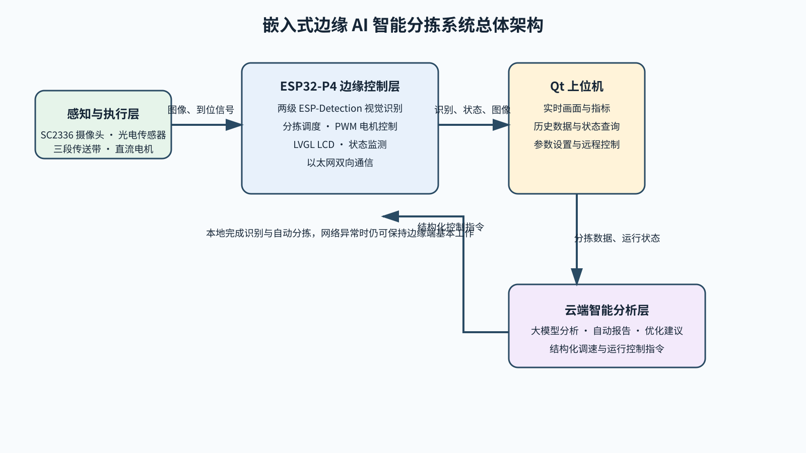
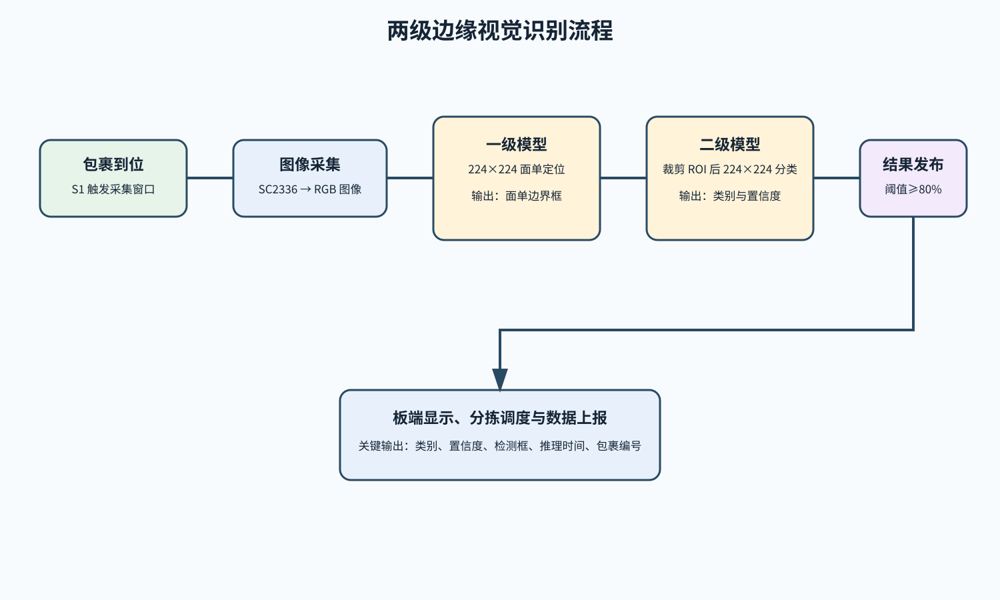
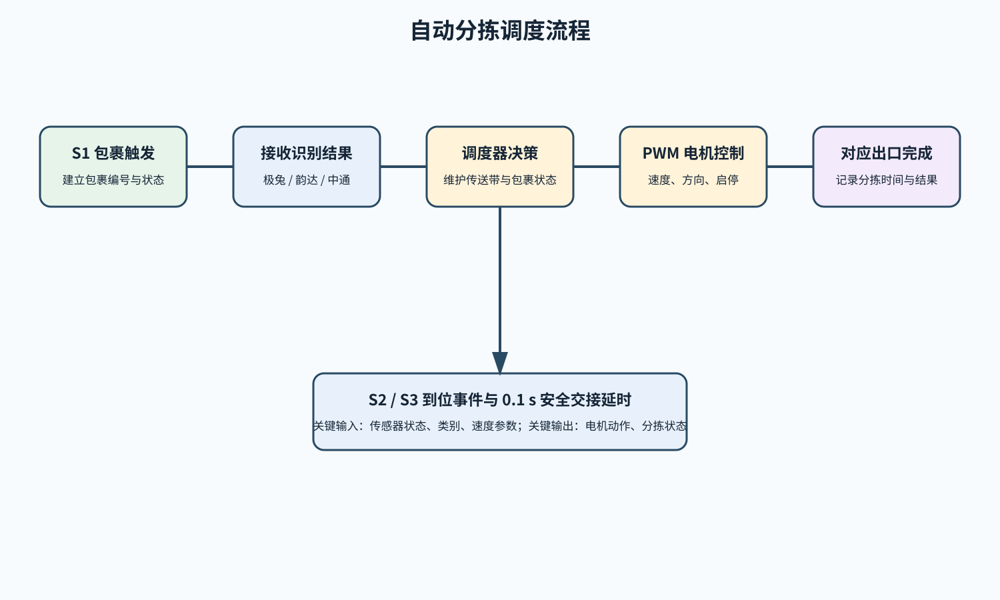
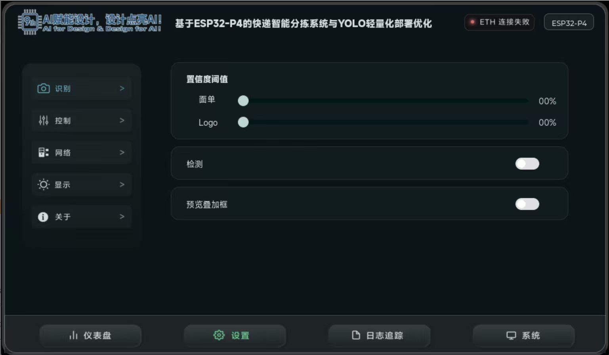
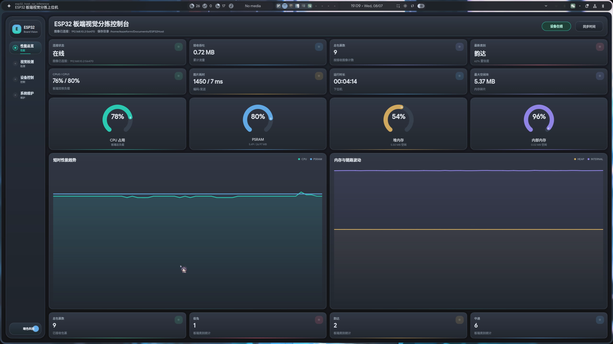
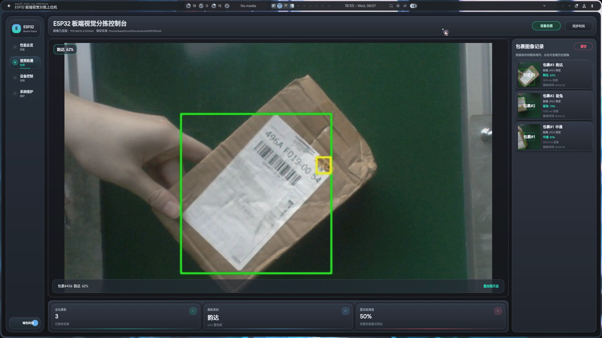
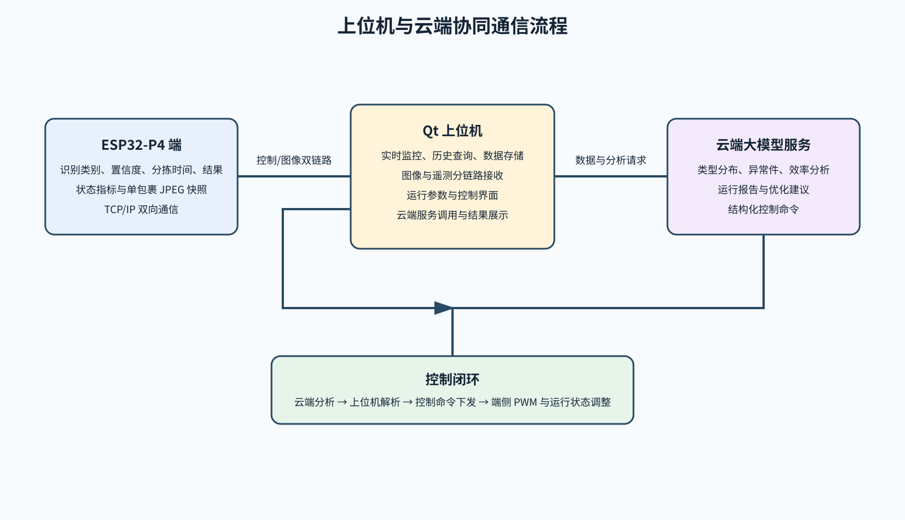
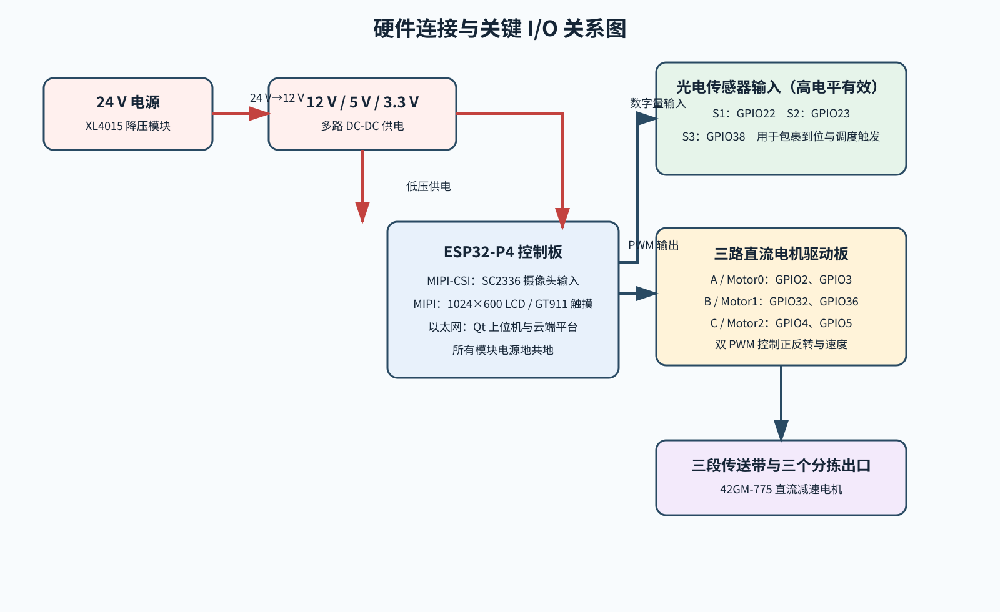
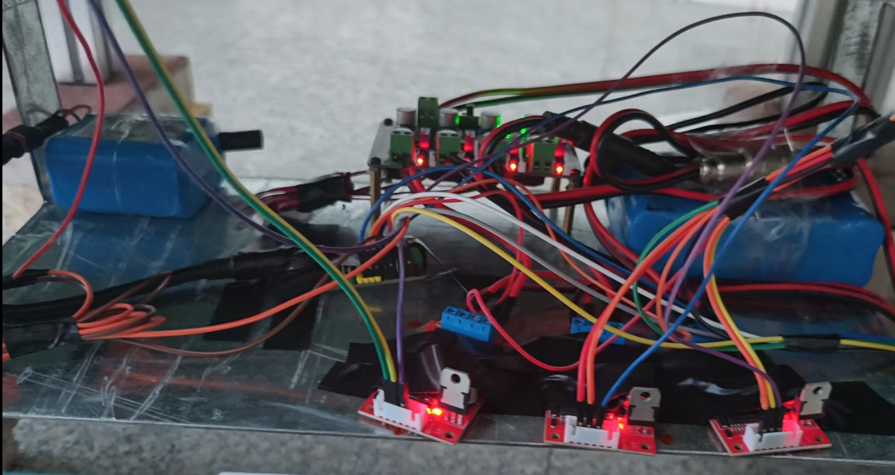
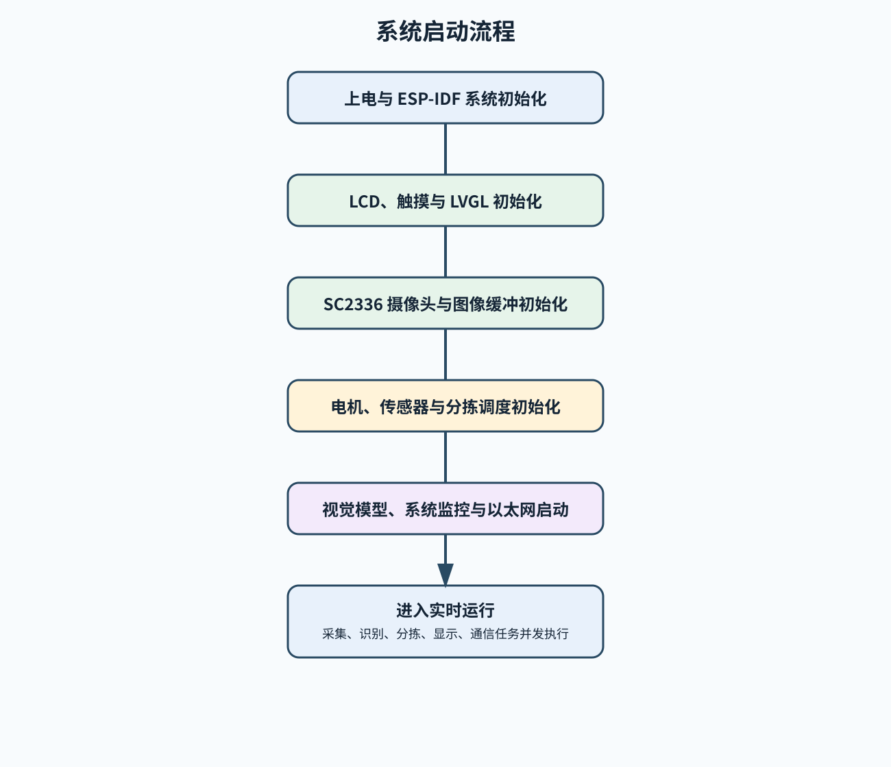

# 嵌入式边缘 AI 智能分拣系统

## 摘要

本作品聚焦末端快递分拣场景，基于 ESP32-P4 构建嵌入式边缘 AI 智能分拣系统。系统以传送带流水线为核心，通过 SC2336 MIPI-CSI 摄像头实时采集包裹图像，在 ESP32-P4 端运行两级 ESP-Detection 模型完成快递公司归属识别；使用光电传感器检测包裹位置，以三路直流减速电机执行传送和分流；基于 LVGL 设计 LCD 人机交互界面，实时显示检测画面、识别结果及系统性能数据，并支持本地调整运行参数。

每个包裹的识别类别、置信度、分拣时间和分拣结果通过以太网上传至云端。Qt 上位机提供实时数据展示、历史统计查询、运行状态监测和远程控制功能，并调用云端大模型服务对包裹类型分布、异常件比例、分拣效率和设备运行状态进行分析，自动生成数据分析报告、运行优化建议和电机调速指令。结构化控制命令由上位机下发至 ESP32-P4，实现传送带速度及系统运行状态的远程智能控制，形成“边缘 AI 感知、本地自动分拣、云端智能分析”的完整闭环。

系统使用真实快递包裹在室内自然光条件下完成 300 件测试，包裹包含不同摆放角度及局部 Logo 被黑色墨痕遮挡的情况。系统正确识别 290 件，综合正确率为 96.7%，端侧推理延迟小于 0.1 s，分拣速度达到每分钟 20 件以上，图像接收成功率超过 99%。

**关键词：** ESP32-P4；边缘人工智能；快递分拣；云边协同；两级视觉识别

## 1 设计需求分析

### 1.1 应用场景与问题分析

#### 1.1.1 末端快递分拣需求

末端快递网点和小型仓储场景中的包裹具有数量多、摆放角度变化大、快递公司类别混杂等特点。人工分拣需要工作人员持续观察面单或快递标识，并完成搬运、记录和投放，效率受人员熟练程度和现场条件影响。为降低人工识别负担并提高分拣过程的可追溯性，需要构建一套能够自主感知、识别、输送、分流和记录的智能分拣装置。

本作品针对极兔、韵达、中通三类快递包裹设计。系统需要在包裹经过传送带时及时获取图像，准确识别快递公司归属，并将识别结果转换为对应的分拣动作。系统还需要保留包裹识别和分拣数据，使现场运行结果能够被查询、统计和分析。

#### 1.1.2 边缘端实时性需求

包裹在传送带上连续移动，识别结果必须在包裹到达分流位置前产生。因此，图像采集、模型推理、类别判定和分拣调度需要在端侧快速完成，不能依赖云端返回识别结果。系统选用 ESP32-P4 作为边缘控制器，在本地完成视觉推理和分拣决策，以减少图像传输和云端计算带来的时延，并保证网络暂时不可用时仍可保持本地识别与自动分拣能力。

#### 1.1.3 数据管理与远程控制需求

分拣系统不仅需要完成单次分流，还需要记录包裹类别、置信度、分拣时间、分拣结果和设备运行状态，为后续统计与优化提供依据。系统需要通过以太网将端侧数据上传至上位机和云端平台；用户需要能够在上位机查看实时数据、历史记录和大模型分析报告，并对传送带速度、任务暂停和运行模式进行远程调整。

### 1.2 设计目标

#### 1.2.1 核心功能目标

- 使用摄像头和光电传感器实现包裹图像采集与到位触发。
- 在 ESP32-P4 端完成极兔、韵达、中通三类包裹的本地识别。
- 通过三段传送带和三路电机实现识别结果驱动的自动分拣。
- 使用 LCD 显示检测画面、识别结果、性能数据和运行状态，并支持本地调参。
- 使用 Qt 上位机完成实时监控、历史统计、数据存储和远程控制。
- 使用云端大模型完成运行数据分析、报告生成、优化建议和结构化控制指令生成。

#### 1.2.2 性能目标

| 指标 | 设计目标 |
| --- | --- |
| 识别对象 | 极兔、韵达、中通三类包裹 |
| 识别置信度阈值 | 80% |
| 端侧推理延迟 | 小于 0.1 s |
| 分拣速度 | 每分钟 20 件以上 |
| 图像接收成功率 | 超过 99% |
| 图像上报策略 | 每个包裹对象上传一次 JPEG 图像 |
| 分拣交接延时 | 0.1 s |

## 2 特色与创新

### 2.1 两级边缘视觉识别

#### 2.1.1 面单定位与快递公司分类级联

系统不直接在整幅传送带图像中完成快递公司分类，而是采用“面单定位—ROI 分类”的两级模型级联方案。一级 ESP-Detection 模型以 224×224 图像为输入，检测并定位包裹面单区域；系统提取该区域后，将其输入次级 224×224 模型，完成快递公司类别识别。该方案将分类关注区域聚焦在面单信息上，降低传送带背景、包裹外观差异和无关区域对分类结果的干扰。

#### 2.1.2 本地推理与本地执行

视觉模型部署在 ESP32-P4 端，图像采集、推理、类别判断和分拣调度均在本地完成。端侧推理延迟小于 0.1 s，能够及时为移动中的包裹提供分类结果；网络链路用于数据管理、远程监控和云端协同，而不承担实时识别的关键路径。

### 2.2 感知、控制与分拣闭环

#### 2.2.1 视觉与传感器协同触发

光电传感器实时检测包裹位置。S1 触发包裹对象建立和图像采集窗口，视觉模块输出类别与置信度，后续传感器事件确认包裹交接位置。感知层将识别类别、置信度和包裹到位状态传递给控制层，使每个分拣动作均与对应包裹对象关联。

#### 2.2.2 三路电机调度控制

分拣调度器统一维护包裹编号、类别、传感器事件和传送带状态，并通过 PWM 输出控制三路直流减速电机的启停、速度和方向。系统采用 0.1 s 安全交接延时协调多段传送带的输送过程，将识别结果可靠地转换为物理分流动作。

### 2.3 云边协同智能分析与控制

#### 2.3.1 数据驱动的云端分析

每个包裹的识别类别、置信度、分拣时间和分拣结果均通过以太网上传。云端大模型对包裹类型分布、异常件比例、分拣效率和设备运行状态进行综合分析，自动生成数据分析报告和运行优化建议，使系统从单一的自动执行装置扩展为具备数据洞察能力的智能设备。

#### 2.3.2 结构化远程控制闭环

云端大模型生成的调速和运行控制建议以结构化命令形式返回上位机；Qt 上位机完成命令展示、解析和转发；ESP32-P4 接收命令后调整传送带速度、分拣任务状态和运行模式，实现云端智能分析与端侧本地自动控制的协同闭环。

## 3 功能设计

### 3.1 系统总体功能设计

#### 3.1.1 分层功能架构

系统由感知与执行层、ESP32-P4 边缘控制层、Qt 上位机和云端智能分析层构成。感知与执行层获取包裹图像、检测包裹位置并执行输送分流；边缘控制层完成识别、调度、显示和通信；上位机完成实时展示、历史查询、数据管理和远程控制；云端大模型完成智能分析和优化指令生成。

图 1 系统总体架构图

#### 3.1.2 功能数据流

包裹进入主传送带后，传感器产生到位信号，摄像头采集图像并交由边缘视觉模块识别。识别结果一方面发布至 LCD 显示，另一方面输入分拣调度器；调度器结合传感器事件控制电机完成分类分流。同时，识别结果、分拣时间、分拣结果和设备状态通过以太网上传给上位机与云端平台，云端生成的结构化控制命令再通过上位机返回端侧。

### 3.2 边缘视觉功能设计

#### 3.2.1 图像采集与一级面单定位

SC2336 MIPI-CSI 摄像头实时采集传送带上的包裹图像。一级模型接收 224×224 输入图像，输出面单位置，为后续分类提供准确的感兴趣区域。摄像头安装于主传送带上方约 60 cm 位置，并采用手动调焦方式保证面单与快递标识清晰成像。

#### 3.2.2 二级 ROI 快递公司识别

系统从一级模型输出的面单区域提取 ROI，并将其送入次级 224×224 模型。模型输出极兔、韵达、中通类别及对应置信度；置信度达到 80% 的结果被发布到显示、控制和通信模块。每个包裹对象仅发送一次 JPEG 图像，避免同一包裹的重复图像传输。

图 2 两级边缘视觉识别流程图

### 3.3 自动分拣功能设计

#### 3.3.1 传感器与包裹状态管理

系统使用高电平有效的光电传感器检测包裹位置。S1 接入 GPIO22，S2 接入 GPIO23，S3 接入 GPIO38。S1 的到位事件建立包裹编号并触发视觉窗口；调度器将识别结果关联到该编号，并根据后续传感器到位事件维护包裹输送状态。

#### 3.3.2 电机控制与分流执行

三路直流有刷减速电机分别驱动三段传送带。电机 A 使用 GPIO2、GPIO3 双 PWM 输出，电机 B 使用 GPIO32、GPIO36 双 PWM 输出，电机 C 使用 GPIO4、GPIO5 双 PWM 输出。ESP32-P4 根据类别、包裹位置和分拣状态控制传送带启停、速度调节和分流方向。

图 3 自动分拣调度流程图

### 3.4 人机交互与监控功能设计

#### 3.4.1 板端 LCD 交互

板端基于 LVGL 设计仪表盘、参数设置、日志追踪和系统资源界面。界面实时显示检测画面、识别类别、置信度、推理时间、运行状态和系统性能数据，并支持在现场调整视觉阈值及相关运行参数。

图 4 板端仪表盘界面

图 5 板端参数设置界面

#### 3.4.2 Qt 上位机监控

Qt 上位机实现设备通信、实时数据展示、历史数据查询、运行状态监测和远程控制。上位机接收并显示包裹识别类别、置信度、分拣时间、分拣结果和设备状态，同时保存数据用于历史统计和云端分析。用户可通过上位机调整端侧运行参数和传送带速度。

图 6 上位机性能总览界面

图 7 上位机视觉检测与历史记录界面

### 3.5 云端协同功能设计

#### 3.5.1 TCP/IP 双向通信

设备端 ESP32-P4 通过以太网与上位机和云端平台建立 TCP/IP 双向通信。端侧实时上传包裹识别类别、置信度、分拣时间、分拣结果和设备运行状态；上位机接收图像、控制数据和运行指标，并将用户操作或云端指令下发到 ESP32-P4。

#### 3.5.2 大模型分析与远程智能控制

云端大模型对上位机管理的分拣数据进行综合分析，生成数据分析报告、运行优化建议和结构化控制命令。上位机接收分析结果并将控制命令下发给 ESP32-P4，端侧据此执行传送带速度调节、分拣任务暂停和运行模式切换。

图 8 上位机与云端协同通信流程图

## 4 系统实现

### 4.1 硬件系统实现

#### 4.1.1 机械与视觉采集实现

机械部分由 4080 国标铝型材机架、主动与从动滚筒和三段传送带构成。主传送带 A 尺寸为 100 cm×40 cm，分拣传送带 B、C 尺寸均为 40 cm×40 cm。SC2336 摄像头固定在主传送带上方，持续采集包裹图像；三台 42GM-775 行星直流减速电机提供传送带动力。

图 9 系统整体正面实拍图

图 10 三段传送带整体布局

图 11 摄像头安装位置与传送带视野

#### 4.1.2 电路与关键 I/O 实现

系统使用 24 V 电源，经 XL4015 降压模块和多路 DC-DC 模块为电机、控制器、传感器及外设供电，各模块地线共地。ESP32-P4 通过 MIPI-CSI 接收摄像头图像，通过 LCD 和触摸屏完成显示与交互，通过传感器输入获取包裹位置，通过三路双 PWM 输出控制电机驱动板。

图 12 硬件连接与关键输入、输出信号图

图 13 电源模块与电机驱动实物接线图

### 4.2 嵌入式软件实现

#### 4.2.1 系统启动与任务初始化

嵌入式端基于 ESP-IDF 5.5.4 开发，采用 C/C++ 实现硬件初始化、图像采集、图像预处理、边缘 AI 模型推理、光电传感器检测、电机 PWM 控制、LVGL 界面显示和以太网通信。系统上电后依次初始化 LCD、触摸、摄像头、电机、传感器、LVGL、视觉模型、系统监控和网络通信，随后进入实时运行状态。

图 14 嵌入式端系统启动流程图

#### 4.2.2 分拣结果与运行数据上报

视觉模块输出类别、置信度、检测框和推理时间；分拣调度模块输出分拣时间、分拣结果和设备状态。通信模块将这些结构化数据发送至上位机，并对每个包裹对象发送一次 JPEG 图像。端侧同时接收远程控制命令，用于调整传送带速度、任务状态和运行模式。

### 4.3 上位机与云端实现

#### 4.3.1 上位机数据管理实现

Qt 上位机作为设备交互与数据管理中心，负责接收设备数据、展示实时画面、存储历史记录、查询统计信息和下发控制命令。上位机界面包含性能总览、视觉检测、设备控制和系统维护等功能页面。

图 15 上位机设备控制界面

图 16 上位机系统维护界面

#### 4.3.2 云端大模型协同实现

上位机调用云端大模型服务，对包裹类型分布、异常件比例、分拣效率及设备运行状态进行分析，自动生成数据分析报告和运行优化建议。云端返回的结构化控制命令由上位机转发至 ESP32-P4，实现云端智能分析与设备远程控制。

## 5 其他内容

### 5.1 测试与性能结果

#### 5.1.1 识别准确率测试

测试在室内自然光条件下进行，使用真实快递包裹，包裹按不同角度摆放，并包含部分 Logo 被黑色墨痕覆盖的样本。每类包裹测试 100 件，以系统输出类别与包裹真实所属快递公司一致作为正确识别标准；未产生有效识别结果计为漏检，产生非真实类别结果计为错分。

| 类别 | 测试数量 | 正确识别 | 错分 | 漏检 | 正确率 |
| --- | ---: | ---: | ---: | ---: | ---: |
| 极兔 | 100 | 98 | 1 | 1 | 98.0% |
| 韵达 | 100 | 93 | 6 | 1 | 93.0% |
| 中通 | 100 | 99 | 0 | 1 | 99.0% |
| 合计 | 300 | 290 | 7 | 3 | 96.7% |

#### 5.1.2 分拣、通信与交互结果

| 指标 | 测试结果 |
| --- | --- |
| 端侧推理延迟 | 小于 0.1 s |
| 分拣安全交接延时 | 0.1 s |
| 连续分拣速度 | 每分钟 20 件以上 |
| 图像接收成功率 | 超过 99% |
| 包裹图像上传 | 同一包裹对象只发送一次 JPEG 图像 |
| 本地交互 | LCD 可显示结果与性能数据，并可调整相关运行参数 |
| 远程交互 | 上位机可查看实时数据、历史统计和大模型分析报告，并可调整端侧参数 |

图 17 包裹实际分拣过程

### 5.2 总结与展望

#### 5.2.1 总结

本作品完成了以 ESP32-P4 为核心的嵌入式边缘 AI 智能分拣系统。系统将两级视觉识别、光电传感器触发、三路电机分拣、LVGL 本地交互、Qt 上位机监控和云端大模型分析整合到统一闭环中。测试结果表明，系统在真实包裹和室内自然光条件下具备稳定的识别与分拣能力，满足末端小型分拣场景的实时性要求。

#### 5.2.2 展望

后续可扩充快递公司类别和复杂样本数据，进一步提升遮挡、反光和不同光照条件下的识别能力；可增加分拣支路与传感器数量以提高吞吐能力；可将云端统计分析与仓储管理系统进一步对接，实现订单、包裹和分拣结果的全流程追溯，并通过长期运行数据持续优化调度策略。

## 6 参考文献

1. Espressif Systems. ESP32-P4 Technical Reference Manual[EB/OL].
2. Espressif Systems. ESP-IDF Programming Guide[EB/OL]. https://docs.espressif.com/projects/esp-idf/
3. Espressif Systems. ESP-DL Documentation[EB/OL]. https://docs.espressif.com/projects/esp-dl/
4. LVGL. LVGL Documentation[EB/OL]. https://docs.lvgl.io/
5. The Qt Company. Qt 6 Documentation[EB/OL]. https://doc.qt.io/qt-6/
6. SmartSens Technology. SC2336 CMOS Image Sensor Product Documentation[Z].
7. E18-D80NK Photoelectric Sensor Product Specification[Z].
8. Espressif Systems. ESP32-P4 Series Datasheet[EB/OL].
